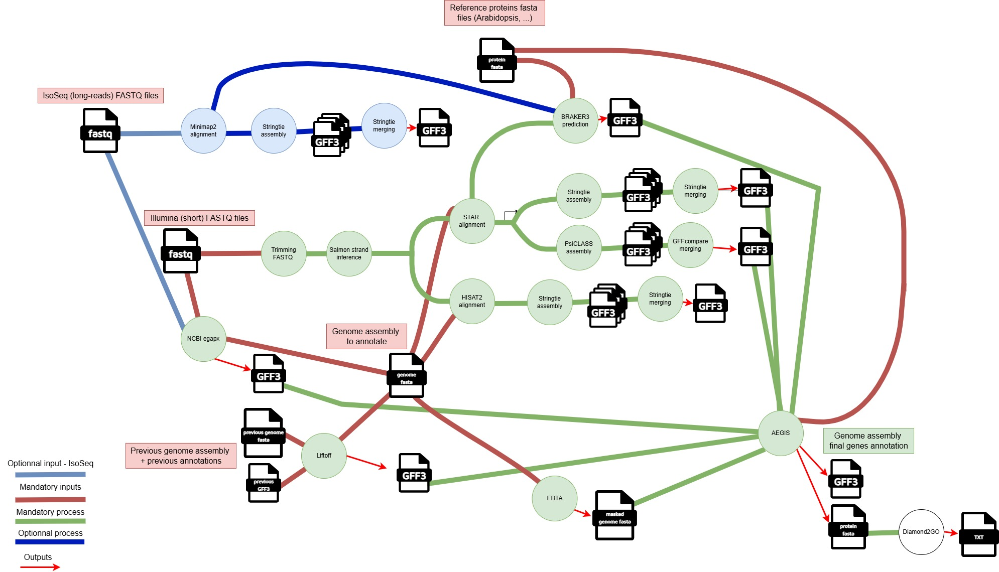

# TITAN: The Intensive Transcript Annotation Pipeline

📖 **Full documentation**: [Read the Docs](https://grapedia.readthedocs.io/en/latest/workflows.html#titan-the-intensive-transcript-annotation-pipeline)

## **Inputs**

The following parameters are defined in `nextflow.config` and are required for the pipeline execution.

Aegis run are launched chromosome by chromosome: a for loop and sequential annotation processing for each chromosome. This is necessary because running on all the chromosomes at the same time requires around 500 GB of RAM. An Aegis ran sequentially on the chromosomes takes around 2/3 days of treatment on 19 chromosomes (Vitis vinifera).

### **Workflow's general parameters**
- **`workflow`**: **Which workflow's part to launch**.  
  _Options_: `"generate_evidence_data"` or `"aegis"` (default: `"generate_evidence_data"`)
  ⚠️ You can simply generate the evidence data with ‘generate_evidence_data’ or launch aegis only with ‘aegis’, but you need to have generated the evidence data first.
- **`output_dir`**: Path to output directory, where the final files will be write.

### **Genome Assemblies**
- **`previous_assembly`**: Path to the **reference genome assembly** (FASTA).  
  _Example_: `data/assemblies/T2T_ref.fasta`
- **`new_assembly`**: Path to the **new genome assembly** to be annotated (FASTA).  
  _Example_: `data/assemblies/riesling.hap1.chromosomes.phased.fa`

### **Annotations & Data evidences**
- **`previous_annotations`**: Path to the **GFF3 file** containing annotations for the previous assembly.  
  _Example_: `data/annotations/PN40024_5.1_on_T2T_ref_with_names.gff3`
- **`RNAseq_samplesheet`**: Path to the **RNA-seq samplesheet** (CSV file) listing RNA-seq datasets to be used.  
  _Example_: `data/RNAseq_data/RNAseq_samplesheet.csv`
- **`protein_samplesheet`**: Path to the **protein data samplesheet** (CSV file) listing protein datasets to be used.  
  _Example_: `data/protein_data/samplesheet.csv`

### **Other Parameters**
- **`EDTA`**: Whether to run **EDTA (transposable element annotation tool)**.  
  _Options_: `"yes"` or `"no"` (default: `"no"`)
  ⚠️ If EDTA is not set to "yes", the Aegis and Diamond2Go steps will not be executed, as Aegis requires a hard-masked genome. TITAN will only generate the evidence data.
- **`use_long_reads`**: Flag to indicate whether **long-read sequencing data** should be used.  
  _Options_: `true` or `false` (default: `true`)
- **`PSICLASS_vd_option`**: For PSICLASS process, the minimum average coverage depth of a transcript to be reported (FLOAT). This option is used to reduce the number of false monoexon genes.
  default: `"5.0"`
- **`PSICLASS_c_option`**: For PSICLASS process, only use the subexons with classifier score <= than the given number (FLOAT). This option is used to reduce the number of false monoexon genes.
  default: `"0.03"`
- **`STAR_memory_per_job`**: For STAR alignment process. If the depth of your RNAseq samples is high, TITAN may crash with an out of memory error, during the STAR alignment step. You can increase the memory here, it's in bytes, for example 60000000000 is about 55Gb per sample/job.
  default: `"60000000000"`
- **`paramfile_egapx`**: The input parameter file for NCBI/egapx annotation pipeline run.
  default: `"$projectDir/data/input_egapx.yaml"`

## **Example command-line to run**

```bash
#!/usr/bin/env bash
# Exit immediately if a command exits with a non-zero status
# Ensures AEGIS doesn't run if generate_evidence_data fails
set -e
# Navigate to the project workflow directory
cd /path/to/projectDir/workflows/TITAN
# Load required Nextflow module
module load nextflow/24.04.3
# Run the 'generate_evidence_data' workflow and generate its DAG
nextflow run main.nf \
  -with-dag dag_evidence_data.png \
  --workflow generate_evidence_data
# Run the 'aegis' workflow and generate its DAG
nextflow run main.nf \
  -with-dag dag_aegis.png \
  --workflow aegis
```

## Workflow DAG



## Workflow Components

### **Liftoff Annotations**
Generates a **GFF3 file**, which is used by **Aegis** in the final step.

### **NCBI/egapx Annotations**
Generates a **GFF3 file**, which is used by **Aegis** in the final step.

### **StringTie Merging (Short Reads - HISAT2)**
Generates **GTF file(s)**.  
- For each **short-read RNA-seq dataset**, a transcriptome is assembled using **HISAT2/StringTie**.  
- Transcriptomes are then **merged separately** for **stranded** and **unstranded** samples (unstranded is optional).  
- ⚠️ **This output is not used yet**—it is intended for **lncRNA detection**, which is not yet implemented.

### **StringTie Merging (Short Reads - STAR)**
Generates **GTF file(s)**, which are used by **Aegis** in the final step.  
- For each **short-read RNA-seq dataset**, a transcriptome is assembled using **STAR/StringTie** with **default** and **alternative (alt) parameters**.  
- Transcriptomes are **merged separately** for **stranded** and **unstranded** samples (unstranded is optional) and for **default and alt parameters** separately.

### **StringTie Merging (Long Reads)**
Generates a **single GTF file**, which is used by **Aegis** in the final step.  
- For each **IsoSeq RNA-seq dataset**, a transcriptome is assembled using **Minimap2/StringTie** with **default** and **alt parameters**.  
- These transcriptomes are then **merged into a single GTF file**, for **default and alt parameters** separately.
- ⚠️ **Long-read integration is optional**.

### **BRAKER3 Gene Prediction**
#### **braker3_prediction OR braker3_prediction_with_long_reads**
- **BRAKER3** is run with all **BAM files**, generated using **STAR (short reads)** or **Minimap2 (long reads)**.
- It also incorporates **protein FASTA files** to generate:
  - A **GeneMark GTF file**.
  - An **AUGUSTUS GFF3 file**, both of which are used by **Aegis** in the final step.

### **GFFCompare**
Generates a **GTF file**, which is used by **Aegis** in the final step.  
- For each **short-read RNA-seq dataset**, a transcriptome is assembled using **STAR/PsiCLASS**.  
- Transcriptomes are **merged separately** for **stranded** and **unstranded** samples using **GFFCompare** (unstranded is optional).

### **EDTA**
*(Integrated into TITAN, though not explicitly shown in the DAG)*  
Generates a **FASTA file** of the **hard-masked genome assembly**, which is used by **Aegis** in the final step.  

- **Input**: The **FASTA file** of the genome assembly to be annotated.  
- **Output**: A **hard-masked version** of the genome assembly.  

---

## **Final Integration by Aegis**
At the final step, **Aegis** integrates multiple annotation sources:  
✔ **Hard-masked genome assembly**
✔ **Liftoff annotations**  
✔ **NCBI/egapx annotations**  
✔ **GeneMark annotations**  
✔ **AUGUSTUS annotations**  
✔ **Stranded (and unstranded, if available) annotations from STAR/StringTie**  
✔ **IsoSeq annotations (if available)**  
✔ **Stranded (and unstranded, if available) annotations from STAR/PsiCLASS**  
✔ **protein FASTA files**

### **📖 Reference**  
Soon available ...

This results in the final **GFF3 annotation file**.

## **Diamond2GO**  
*(Integrated into TITAN, though not explicitly shown in the DAG)*  

Diamond2GO performs **functional gene annotation** based on the **final Aegis protein FASTA files** (both "main" and "all" sets).  

### **🔹 Input**  
- FASTA files containing the **"main"** and **"all"** protein sequences generated by Aegis.  

### **🔹 Output**  
- Functional annotations assigned by **Diamond2GO**.  

## **📖 Tools version used**  

### Aegis
- Source from [GitHub](https://github.com/davnapa/genomics.git)
- **Version**: v2025_05_20
- **Docker image**: avelt/aegis:v2025_05_20 (dockerhub)

### Agat
- **Version**: 1.2.0
- **Docker image**: quay.io/biocontainers/agat:1.2.0--pl5321hdfd78af_0

### BRAKER3
- **Version**: v3.0.8  
- **Dependencies**:
  - **spaln**: Ver.2.3.3  
  - **ProtHint**: 2.6.0  
  - **GeneMark-ETP**: Last version from [GitHub](https://github.com/gatech-genemark/GeneMark-ETP) (commit: `81ac83e`)  
  - **Augustus**: Last version from [GitHub](https://github.com/Gaius-Augustus/Augustus) (commit: `487b12b`)  
  - **bamtools**: v2.5.2  
  - **samtools**: 1.9  
  - **diamond**: v2.1.9  
  - **cdbfasta**: Last version from [GitHub](https://github.com/gpertea/cdbfasta.git) (commit: `da8f5ba`)  
  - **TSEBRA**: Last version from [GitHub](https://github.com/Gaius-Augustus/TSEBRA) (commit: `c87ba3a`)
- **Docker image**: avelt/braker3:latest (dockerhub)

### Diamond2GO
- **Version**: Last version from [GitHub](https://github.com/rhysf/Diamond2GO.git) (commit: `57bb4cc`)
- **Docker image**: avelt/diamond2go:latest (dockerhub)

### EDTA
- **Version**: Last version from [GitHub](https://github.com/oushujun/EDTA.git)  
- **Dependencies**:
  - **bedtools**: v2.30.0  
  - **samtools**: 1.9
- **Docker image**: avelt/edta:latest (dockerhub)

### egapx
- **Version**: 0.3.2-alpha [GitHub](https://github.com/ncbi/egapx)  
- **Dependencies**:
  - **Python**: 3.12  
  - **Java**: openjdk version 17.0.15
  - **Nextflow**: 25.04.2.5947
- **Docker image**: avelt/ncbi_egapx:0.3.2-alpha (dockerhub)

### fastp
- **Version**: 0.23.2
- **Docker image**: quay.io/biocontainers/fastp:0.23.2--hb7a2d85_2

### GFFCompare
- **Version**: 0.12.6
- **Docker image**: avelt/gffcompare:latest (dockerhub)

### HISAT2
- **Version**: 2.2.1
- **Docker image**: avelt/hisat2:latest (dockerhub)

### Liftoff
- **Version**: 1.5.1  
- **Docker image**: quay.io/biocontainers/liftoff:1.5.1--py_0

### Minimap2
- **Version**: 2.28  
- **Dependencies**:
  - **samtools**: 1.9
- **Docker image**: avelt/minimap2_samtools:latest (dockerhub)

### PsiCLASS
- **Version**: 1.0.2  
- **Docker image**: avelt/psiclass_samtools:latest (dockerhub)

### sra-tools
- **Version**: 3.1.1  
- **Docker image**: quay.io/biocontainers/sra-tools:3.1.1--h4304569_0

### STAR
- **Version**: 2.7.11b
- **Docker image**: quay.io/biocontainers/star:2.7.11b--h43eeafb_2

### Salmon
- **Version**: 1.10.3
- **Docker image**: quay.io/biocontainers/salmon:1.10.3--haf24da9_3

### StringTie
- **Version**: 2.2.3  
- **Docker image**: avelt/stringtie:latest (dockerhub)

## **📖 Reference**  

**Aegis** : TO DO

**Agat** : Dainat J. *Another Gtf/Gff Analysis Toolkit (AGAT): Resolve interoperability issues and accomplish more with your annotations.*  
📄 [Plant and Animal Genome XXIX Conference, 2022](https://github.com/NBISweden/AGAT)

**BRAKER3** : Gabriel et al. *BRAKER3: Fully automated genome annotation using RNA-seq and protein evidence with GeneMark-ETP, AUGUSTUS, and TSEBRA*  
📄 [Genome Res, 2024](https://pubmed.ncbi.nlm.nih.gov/38866550/)

**Diamond2GO** : Golden et al. *DIAMOND2GO: A rapid Gene Ontology assignment and enrichment tool for functional genomics.*  
📄 [bioRxiv, 2024](https://www.biorxiv.org/content/10.1101/2024.08.19.608700v1)

**EDTA** : Ou et al. *Benchmarking Transposable Element Annotation Methods for Creation of a Streamlined, Comprehensive Pipeline.*  
📄 [Genome Biol., 2019](https://genomebiology.biomedcentral.com/articles/10.1186/s13059-019-1905-y)

**egapx (NCBI)** : *The NCBI Eukaryotic Genome Annotation Pipeline.*  
📄 [ncbi.nlm.nih.gov](https://www.ncbi.nlm.nih.gov/refseq/annotation_euk/process)

**fastp** : Chen et al. *fastp: an ultra-fast all-in-one FASTQ preprocessor*  
📄 [Bioinformatics., 2018](https://academic.oup.com/bioinformatics/article/34/17/i884/5093234)

**GFFCompare** : Pertea et al. *GFF Utilities: GffRead and GffCompare.*  
📄 [F1000Research., 2020](https://pubmed.ncbi.nlm.nih.gov/32489650/)

**GffRead** : Pertea et al. *GFF Utilities: GffRead and GffCompare.*  
📄 [F1000Research., 2020](https://pubmed.ncbi.nlm.nih.gov/32489650/)

**HISAT2** : Kim et al. *Graph-based genome alignment and genotyping with HISAT2 and HISAT-genotype*  
📄 [Nature biotechnology, 2019](https://www.nature.com/articles/s41587-019-0201-4)

**Liftoff** : Shumate et al. *Liftoff: accurate mapping of gene annotations*  
📄 [Bioinformatics, 2021](https://academic.oup.com/bioinformatics/article/37/12/1639/6035128?login=false)

**Minimap2** : Li et al. *Minimap2: pairwise alignment for nucleotide sequences*  
📄 [Bioinformatics, 2018](https://academic.oup.com/bioinformatics/article/34/18/3094/4994778)

**PsiCLASS** : Song et al. *A multi-sample approach increases the accuracy of transcript assembly*  
📄 [Nature communications., 2019](https://www.nature.com/articles/s41467-019-12990-0)

**sra-tools** : [GitHub repository](https://github.com/ncbi/sra-tools)

**STAR** : Dobin et al. *STAR: ultrafast universal RNA-seq aligner*  
📄 [Bioinformatics, 2013](https://academic.oup.com/bioinformatics/article/29/1/15/272537)

**Salmon** : Patro et al. *Salmon provides fast and bias-aware quantification of transcript expression*  
📄 [Nature methods, 2017](https://www.nature.com/articles/nmeth.4197)

**Samtools** : Li et al. *The Sequence Alignment/Map format and SAMtools*  
📄 [Bioinformatics, 2009](https://pmc.ncbi.nlm.nih.gov/articles/PMC2723002/)

**StringTie** : Shumate et al. *Improved transcriptome assembly using a hybrid of long and short reads with StringTie*  
📄 [PLOS Computational Biology, 2022](https://journals.plos.org/ploscompbiol/article?id=10.1371/journal.pcbi.1009730)
