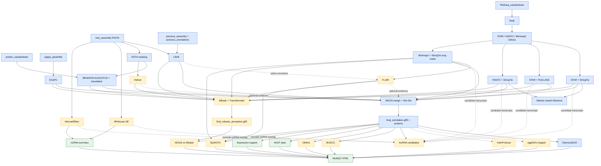

# TITAN: The Intensive Transcript Annotation Pipeline

     

TITAN is a Nextflow pipeline for eukaryotic genome annotation. It integrates
transferred annotation, RNA-seq transcript evidence, protein-supported ab
initio prediction, repeat masking, EGAPx, optional ncRNA/lncRNA and isoform
branches, functional annotation, and final quality reporting into one
reproducible graph.

Contributors: David Navarro, Antonio Santiago, Jose Tomas Matus, Amandine
Velt, Camille Rustenholz and Marco Moretto.

Full setup details are in [docs/user/installation.md](docs/user/installation.md).
Tool details are in [docs/reference/tools.md](docs/reference/tools.md).
Contributor guidance is in [CONTRIBUTING.md](CONTRIBUTING.md).
Site-specific examples are kept under [examples/](examples/).

## What TITAN Produces

TITAN has one public execution mode: evidence generation, EDTA, EGAPx and
AEGIS always run together. Long-read processing is automatic when
`RNAseq_samplesheet` contains at least one `library_layout=long` row.

Core outputs are a final AEGIS GFF3/protein set, transferred and predicted
evidence tracks, optional alternative/specialized annotations, functional
annotation tables, provenance manifests, validation reports and a final
MultiQC HTML report.

## Workflow Graph


```mermaid
flowchart TD
    classDef core fill:#dbe9ff,stroke:#3366cc,color:#111
    classDef opt fill:#fff3cd,stroke:#cc9900,color:#111,stroke-dasharray:4 3
    classDef qc fill:#e6f4ea,stroke:#2e7d32,color:#111

    NEW[new_assembly FASTA]:::core
    PREV[previous_assembly + previous_annotations]:::core
    RNA[RNAseq_samplesheet]:::core
    PROT[protein_samplesheet]:::core
    EGCFG[egapx_paramfile]:::core

    LIFT[Liftoff]:::core
    EDTA[EDTA masking]:::core
    EGAPX[EGAPx]:::core
    FASTP[fastp]:::core
    IDX[STAR / HISAT2 / Minimap2 indices]:::core
    STAR[STAR + StringTie]:::core
    PSI[STAR + PsiCLASS]:::core
    HISAT[HISAT2 + StringTie]:::core
    MM2[Minimap2 + StringTie long reads]:::core
    STRAND[Salmon strand inference]:::core
    BRAKER[BRAKER3 AUGUSTUS + GeneMark]:::core

    TRNA[tRNAscan-SE]:::opt
    RFAM[Infernal/Rfam]:::opt
    HELIXER[Helixer]:::opt
    FLAIR[FLAIR]:::opt

    AEGIS[AEGIS merge + Vitvi IDs]:::core
    FINAL[final_annotation.gff3 + proteins]:::core
    D2GO[Diamond2GO]:::core
    EGG[eggNOG-mapper]:::opt
    IPS[InterProScan]:::opt

    LNC[lncRNA candidates]:::opt
    MIK[Mikado + TransDecoder]:::opt
    MIKGFF[final_mikado_annotation.gff3]:::opt

    BUSCO[BUSCO]:::opt
    OMARK[OMArk]:::opt
    SQANTI[SQANTI3]:::opt
    AGAT[AGAT stats]:::qc
    NCRNA[ncRNA summary]:::qc
    EXPR[Expression support]:::qc
    SRCQC[AEGIS vs Mikado]:::opt
    MULTIQC[MultiQC HTML]:::qc

    NEW --> LIFT & EDTA & TRNA & RFAM
    PREV --> LIFT
    EGCFG --> EGAPX
    RNA --> FASTP --> IDX --> STAR & PSI & HISAT & MM2
    STAR & HISAT --> STRAND
    PROT --> BRAKER
    EDTA --> BRAKER & HELIXER
    MM2 --> FLAIR
    LIFT -.splice correction.-> FLAIR

    LIFT & EGAPX & BRAKER & STAR & PSI & HISAT & MM2 --> AEGIS
    HELIXER & FLAIR -.optional evidence.-> AEGIS
    AEGIS --> FINAL --> D2GO
    FINAL -.-> EGG & IPS

    FINAL --> LNC
    TRNA & RFAM -.exclude ncRNA overlap.-> LNC
    STAR & PSI & HISAT & MM2 -.candidate transcripts.-> LNC
    LIFT & EGAPX & BRAKER & STAR & PSI & HISAT & MM2 & HELIXER & FLAIR --> MIK --> MIKGFF

    FINAL --> BUSCO & OMARK & AGAT & EXPR & SQANTI
    TRNA & RFAM --> NCRNA
    MM2 & FLAIR --> SQANTI
    FINAL & MIKGFF --> SRCQC
    D2GO & EGG & IPS & BUSCO & OMARK & AGAT & NCRNA & SQANTI & EXPR & SRCQC --> MULTIQC
```

Blue nodes are the core graph, yellow dashed nodes are optional branches, and
green nodes are quality-report steps. Nextflow's per-run `-with-dag` report
shows the full per-sample task fan-out.

## Quick Start

```bash
git clone git@github-amandine:Grapedia/workflows.git
cd workflows/TITAN
scripts/run-tests.sh
```

Production runs should go through the launcher:

```bash
./launch_TITAN_example.sh \
  --profile slurm,apptainer \
  --output-dir /absolute/path/to/project/titan_out \
  --previous-assembly /absolute/path/to/project/assemblies/previous.fa \
  --new-assembly /absolute/path/to/project/assemblies/target.fa \
  --previous-annotations /absolute/path/to/project/annotations/previous.gff3 \
  --rnaseq-samplesheet /absolute/path/to/project/rnaseq/RNAseq_samplesheet.csv \
  --rnaseq-data-dir /absolute/path/to/project/rnaseq \
  --protein-samplesheet /absolute/path/to/project/proteins/protein_samplesheet.csv \
  --egapx-paramfile /absolute/path/to/project/egapx/input_egapx.yaml \
  --run-name titan_target_v1 \
  --resume
```

The launcher resolves paths, checks profile/container contracts, validates
inputs and writes Nextflow reports under `${output_dir}/nextflow_reports`.

## Requirements

Use Linux or HPC with Bash, Git, Python 3, Java, Nextflow `24.04.3`, and Docker
or Apptainer/Singularity. EGAPx also needs host `python3`, `curl`, `tar` and
Python `yaml` because TITAN launches the official nested EGAPx runner.

## Inputs

| Parameter | Required content |
| --- | --- |
| `--new_assembly` | Target genome assembly FASTA. |
| `--previous_assembly` | Reference assembly FASTA for Liftoff. |
| `--previous_annotations` | GFF3 matching `--previous_assembly`. |
| `--RNAseq_samplesheet` | CSV with `sampleID,SRA_or_FASTQ,library_layout`. |
| `--RNAseq_data_dir` | Local FASTQ/FASTA directory for samplesheet rows. |
| `--protein_samplesheet` | CSV with `organism,filename` protein FASTA evidence. |
| `--egapx_paramfile` | EGAPx YAML with at least `genome`, `taxid`, `organism`. |
| `--output_dir` | TITAN output directory. |

RNA-seq `library_layout` values are `single`, `paired` and `long`.
`SRA_or_FASTQ` values are `FASTQ`, `FASTA` for long reads, and `SRA` accessions
resolved through ENA FASTQ metadata. Local files are inferred from `sampleID`.
Absolute paths are recommended for production and HPC runs.

## Tool Matrix

Detailed behavior, setup notes and outputs are in [docs/reference/tools.md](docs/reference/tools.md).

| Tool or branch | Default | Purpose |
| --- | --- | --- |
| [Input validation](docs/reference/tools.md#input-validation) | on | Checks inputs before heavy work starts. |
| [tRNAscan-SE](docs/reference/tools.md#trnascan-se) | off | Optional tRNA annotation. |
| [Infernal/Rfam](docs/reference/tools.md#infernalrfam-ncrna) | off | Optional ncRNA family search. |
| [RNA-seq evidence](docs/reference/tools.md#rna-seq-evidence) | on | Builds STAR/HISAT2/Minimap2 transcript evidence. |
| [Liftoff](docs/reference/tools.md#liftoff) | on | Transfers previous annotation. |
| [EGAPx](docs/reference/tools.md#egapx) | on | Adds official NCBI annotation evidence. |
| [FLAIR](docs/reference/tools.md#flair-long-read-isoforms) | off | Optional long-read isoform evidence. |
| [EDTA](docs/reference/tools.md#edta) | on | Produces the hard-masked genome for AEGIS. |
| [BRAKER3](docs/reference/tools.md#braker3) | on | Generates ab initio gene predictions. |
| [Helixer](docs/reference/tools.md#helixer) | off | Optional deep-learning prediction evidence. |
| [AEGIS](docs/reference/tools.md#aegis) | on | Integrates evidence into the primary annotation. |
| [Mikado + TransDecoder](docs/reference/tools.md#mikado-final-annotation-source) | off | Optional alternative final annotation source. |
| [lncRNA candidates](docs/reference/tools.md#lncrna-candidates) | off | Optional CPAT-plant candidate layer. |
| [SQANTI3](docs/reference/tools.md#sqanti3-long-read-isoform-qc) | off | Optional long-read isoform QC. |
| [Diamond2GO](docs/reference/tools.md#diamond2go) | on | Annotates final AEGIS proteins. |
| [eggNOG-mapper](docs/reference/tools.md#eggnog-mapper) | off | Optional orthology/function. |
| [InterProScan](docs/reference/tools.md#interproscan) | off | Optional domains, GO and pathways. |
| [Quality report](docs/reference/tools.md#quality-report) | mixed | BUSCO, OMArk, AGAT, expression and MultiQC. |

## Profiles

| Profile | Purpose |
| --- | --- |
| `test` | Local fixture validation; no Docker, Slurm or production data. |
| `local` | Local Docker-oriented production run. |
| `apptainer` | Apptainer/Singularity runtime. |
| `slurm` | Slurm executor settings. |
| `slurm,apptainer` | Recommended HPC production profile. |

Resource policy is centralized in [conf/base.config](conf/base.config).

## Outputs

| Output family | Main files | Location |
| --- | --- | --- |
| Primary annotation | `final_annotation.gff3`, `final_annotation_proteins_*.fasta` | `${output_dir}/aegis_outputs` |
| Evidence tracks | Liftoff, EDTA, BRAKER3, transcript evidence and EGAPx outputs | `${output_dir}`, `${output_dir}/egapx` |
| Functional annotation | Diamond2GO, optional eggNOG-mapper and InterProScan outputs | `${output_dir}/Diamond2GO_outputs`, `${output_dir}/EggNOG_outputs`, `${output_dir}/InterProScan_outputs` |
| Optional annotations | Helixer, FLAIR, SQANTI3, tRNAscan-SE, Rfam, lncRNA and Mikado | `${output_dir}/additional_annotations`, `${output_dir}/final_annotations/mikado` |
| Quality and provenance | BUSCO, OMArk, AGAT, expression support, MultiQC, manifests and validation reports | `${output_dir}/quality_report`, `${output_dir}/provenance`, `${output_dir}/validation` |
| Nextflow reports | report, timeline, trace and DAG | `${output_dir}/nextflow_reports` when using the launcher |

Intermediate/debug outputs are controlled by `--publish_intermediates`
(`true` by default for backward compatibility).

## Resume And Re-Runs

Use `-resume` or `./launch_TITAN_example.sh --resume` after interrupted runs.
Keep the same `--output-dir`, `--work-dir`, profile combination and input paths.
For production, preserve the Nextflow work directory, `.nextflow.log`,
`${output_dir}/nextflow_reports` and `${output_dir}/provenance`.

## Troubleshooting

| Message or symptom | Check |
| --- | --- |
| `Missing required parameter(s)` | Provide every mandatory input. |
| `Required input file(s) not found` | Verify paths on the executing node. |
| `library_layout must be one of` | Use `single`, `paired` or `long`. |
| `at least one short-read row` | Include at least one short-read sample. |
| `--workflow is no longer supported` | Remove `--workflow`; TITAN always runs the full graph. |
| Image, EGAPx or Apptainer failure | Check pinned image access and writable shared cache dirs. |
| STAR memory failure | Increase memory for `star_alignment` in the active profile. |
| Non-empty output directory | Resume with `--resume`, or intentionally override with `--force`. |

## Limitations

The `test` profile and CI run stub execution on synthetic fixtures. They
validate contracts, wiring and early failures, not scientific annotation
quality. Real Slurm/Apptainer behavior still depends on site queue policy,
shared filesystems and container cache settings.

## Tool References

[AEGIS](https://github.com/Tomsbiolab/aegis), [AGAT](https://github.com/NBISweden/AGAT),
[BRAKER3](https://github.com/Gaius-Augustus/BRAKER), [Diamond2GO](https://github.com/rhysf/Diamond2GO),
[eggNOG-mapper](https://github.com/eggnogdb/eggnog-mapper), [EDTA](https://github.com/oushujun/EDTA),
[EGAPx](https://github.com/ncbi/egapx), [fastp](https://github.com/OpenGene/fastp),
[GFFCompare](https://ccb.jhu.edu/software/stringtie/gffcompare.shtml), [Helixer](https://github.com/weberlab-hhu/Helixer),
[HISAT2](https://daehwankimlab.github.io/hisat2/), [InterProScan](https://github.com/ebi-pf-team/interproscan),
[Liftoff](https://github.com/agshumate/Liftoff), [Minimap2](https://github.com/lh3/minimap2),
[PsiCLASS](https://github.com/splicebox/PsiCLASS), [Salmon](https://combine-lab.github.io/salmon/),
[ENA Browser API](https://www.ebi.ac.uk/ena/browser/api/), [STAR](https://github.com/alexdobin/STAR),
[StringTie](https://ccb.jhu.edu/software/stringtie/).
