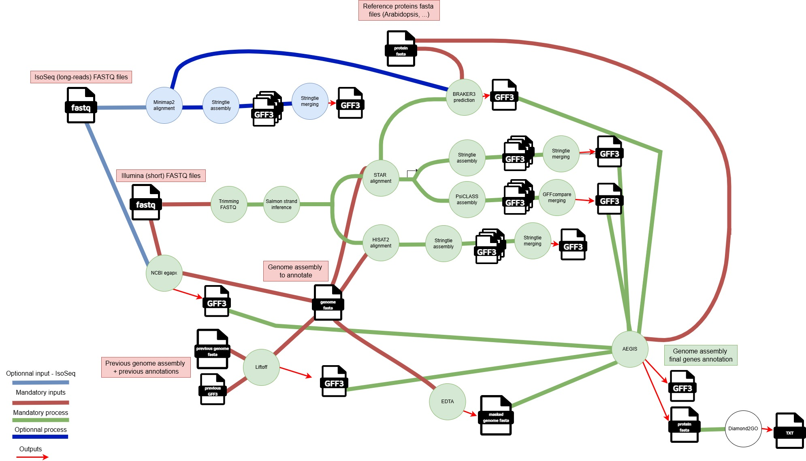

# TITAN: The Intensive Transcript Annotation Pipeline

TITAN is a Nextflow pipeline for eukaryotic genome annotation. It combines transferred annotations, RNA-seq transcript evidence, protein-supported ab initio prediction, repeat masking, EGAPx annotation and final AEGIS integration.

Contributors: David Navarro, Antonio Santiago, Jose Tomas Matus, Amandine Velt, Camille Rustenholz and Marco Moretto.

Full setup details are in [docs/user/installation.md](docs/user/installation.md). Development audits and implementation notes are under [docs/development](docs/development).

## Current Contract

TITAN has one public execution mode: evidence generation, EDTA, EGAPx and AEGIS always run together in the same Nextflow graph. The former partial workflow modes are no longer supported, and `--workflow` is rejected at startup.

Mandatory steps:

* Liftoff transfers the previous annotation to the new assembly.
* EDTA creates the hard-masked target assembly required by AEGIS.
* EGAPx runs from `--egapx_paramfile` and contributes an additional GFF3 evidence.
* STAR/StringTie, STAR/PsiCLASS, HISAT2/StringTie and optional Minimap2/StringTie generate transcript evidence.
* BRAKER3 produces AUGUSTUS and GeneMark evidence.
* AEGIS merges named evidence channels, renames gene/transcript IDs to the canonical `Vitvi...` scheme, tidies feature naming, then extracts final protein FASTA files.
* Diamond2GO annotates the final AEGIS protein sets.

Long-read processing is automatic when `RNAseq_samplesheet` contains at least one row with `library_layout=long`.

## Quick Start

From a fresh clone:

```bash
git clone git@github-amandine:Grapedia/workflows.git
cd workflows/TITAN
scripts/run-tests.sh
```

The quick test suite validates container pins, profile resolution, minimal fixtures, input validation, final annotation structural validation and a full Nextflow `test` profile run in stub mode. It does not run scientific containers or validate biological annotation quality.

For production, prepare inputs and run through the launcher:

```bash
./launch_TITAN_example.sh \
  --profile slurm,apptainer \
  --output-dir /absolute/path/to/project/titan_out \
  --previous-assembly /absolute/path/to/project/assemblies/previous.fa \
  --new-assembly /absolute/path/to/project/assemblies/target.fa \
  --previous-annotations /absolute/path/to/project/annotations/previous.gff3 \
  --rnaseq-samplesheet /absolute/path/to/project/rnaseq/RNAseq_samplesheet.csv \
  --rnaseq-data-dir /absolute/path/to/project/rnaseq \
  --protein-samplesheet /absolute/path/to/project/proteins/protein_samplesheet.csv \
  --egapx-paramfile /absolute/path/to/project/egapx/input_egapx.yaml \
  --run-name titan_target_v1 \
  --resume
```

The launcher resolves paths, checks profile/container contracts, validates inputs and writes Nextflow reports under `${output_dir}/nextflow_reports`.

## Developer Quality Contract

TITAN uses Nextflow DSL2 modules and subworkflows with a stable public graph. Development changes should preserve these contracts:

* Modules should keep workflow logic local to `input:`, `output:`, `script:` and `stub:` blocks. Domain options should be passed as `val` or `path` inputs instead of being read directly from `params`; `params` remains acceptable for containers, labels and publish locations.
* Existing process names are kept stable to avoid breaking `withName` selectors, traces and resume behavior. New processes should use lower snake case matching the module filename, as documented in [docs/development/nextflow-dsl2-conventions.md](docs/development/nextflow-dsl2-conventions.md).
* Every process must use an explicit label from the resource policy in [conf/base.config](conf/base.config).
* Process outputs should be named with `emit:` and should use `path(...)` for files. Avoid broad output globs that can capture temporary files.
* Every process should emit `versions.yml`. For tools where a reliable runtime `--version` command is not available, record at least the process identity and configured container/tool version.
* Shell scripts in modules must use `set -euo pipefail`. Complex repeated shell workflows should live under `scripts/` and be passed into modules as `path` inputs.
* Workflow closures must not read task output files with `file(...).text`; emit values from the producing process or move parsing into a process/script.
* User-facing parameters should be documented and typed in [nextflow_schema.json](nextflow_schema.json).
* Keep `scripts/run-tests.sh` passing. Add focused tests or static checks when changing tuple contracts, module outputs, labels, publication behavior or shared helper scripts.

`nf-test` specs are the preferred direction for future module-level tests once contracts are stable. Until then, TITAN uses Python/static checks plus the full `test` profile stub run in `scripts/run-tests.sh`.

## Requirements

Use Linux or an HPC environment with:

* Bash, Git and Python 3.
* Java compatible with Nextflow.
* Nextflow `24.04.3` for the declared pipeline version.
* Docker for local container runs, or Apptainer/Singularity for HPC.
* `curl` and `tar` for the EGAPx runner bootstrap.

The TITAN EGAPx wrapper intentionally runs on the host rather than inside a TITAN process container. It launches the official EGAPx nested Nextflow runner, so the host environment must provide `python3`, `curl`, `tar`, and the nested executor selected by `--egapx_executor` (`docker`, `singularity`, or `apptainer`). For strict offline reproducibility, pre-stage the pinned EGAPx runner and pass `--egapx_runner_dir`; otherwise TITAN downloads `--egapx_revision` from GitHub during the EGAPx task.

For EGAPx runner support, Python should provide `yaml`:

```bash
python3 -c 'import yaml; print("pyyaml OK")'
```

## Input Files

Required TITAN parameters:

| Parameter | Required content |
| --- | --- |
| `--new_assembly` | Target genome assembly to annotate, FASTA. |
| `--previous_assembly` | Reference assembly used by Liftoff, FASTA. |
| `--previous_annotations` | GFF3 annotation matching `--previous_assembly`. |
| `--RNAseq_samplesheet` | CSV with RNA-seq inputs. |
| `--RNAseq_data_dir` | Directory containing local FASTQ/FASTA files referenced by `sampleID`. |
| `--protein_samplesheet` | CSV listing protein FASTA evidence for BRAKER3/ProtHint. |
| `--egapx_paramfile` | EGAPx YAML input file. |
| `--output_dir` | TITAN output directory. |

Recommended project layout:

```text
project/
  assemblies/
    previous.fa
    target.fa
  annotations/
    previous.gff3
  rnaseq/
    RNAseq_samplesheet.csv
    leaf_single.fastq.gz
    berry_paired_1.fastq.gz
    berry_paired_2.fastq.gz
    isoseq_leaf.fastq.gz
  proteins/
    protein_samplesheet.csv
    araport.fa
    swissprot_plants.fa
  egapx/
    input_egapx.yaml
  titan_out/
```

TITAN validates FASTA, GFF3, samplesheets, local FASTQ/FASTA/protein file presence, EGAPx YAML basics, enum values and numeric options before heavy computation starts.

## RNA-Seq Samplesheet

Header:

```csv
sampleID,SRA_or_FASTQ,library_layout
```

Allowed `library_layout` values:

* `single`: single-end short reads.
* `paired`: paired-end short reads.
* `long`: long-read RNA-seq.

Allowed `SRA_or_FASTQ` values:

* `FASTQ`: local gzip-compressed FASTQ files under `RNAseq_data_dir`.
* `FASTA`: local FASTA file under `RNAseq_data_dir`, only valid with `library_layout=long`.
* `SRA`: SRR, ERR or DRR run accession. TITAN resolves ENA FASTQ URLs, downloads the gzipped FASTQ files, retries transient failures and verifies ENA MD5 checksums when available.

Example:

```csv
sampleID,SRA_or_FASTQ,library_layout
leaf_single,FASTQ,single
berry_paired,FASTQ,paired
isoseq_leaf,FASTQ,long
```

Local files are inferred from `sampleID`:

```text
single: <sampleID>.fastq.gz
paired: <sampleID>_1.fastq.gz and <sampleID>_2.fastq.gz
long:   <sampleID>.fastq.gz or <sampleID>.fasta
```

Local FASTQ/FASTA files remain the most reproducible option for controlled production runs. SRA accessions are accepted when the run is available through ENA FASTQ metadata.

## Protein Samplesheet

Header:

```csv
organism,filename
```

Example:

```csv
organism,filename
Araport,/absolute/path/to/project/proteins/araport.fa
SwissProtPlants,/absolute/path/to/project/proteins/swissprot_plants.fa
```

Relative paths are resolved from the TITAN project directory by the validator. Absolute paths are recommended for production and HPC runs.

## EGAPx Input

`--egapx_paramfile` points to an EGAPx YAML file. TITAN validates at least `genome`, `taxid` and `organism`, and checks that `genome` points to a readable FASTA file.

Minimum:

```yaml
genome: /absolute/path/to/project/assemblies/target.fa
taxid: 29760
organism: Vitis vinifera
```

Recommended with RNA-seq evidence:

```yaml
genome: /absolute/path/to/project/assemblies/target.fa
taxid: 29760
organism: Vitis vinifera
locus_tag_prefix: VITIS

short_reads:
  - - leaf_single
    - - /absolute/path/to/project/rnaseq/leaf_single.fastq.gz
  - - berry_paired
    - - /absolute/path/to/project/rnaseq/berry_paired_1.fastq.gz
      - /absolute/path/to/project/rnaseq/berry_paired_2.fastq.gz

long_reads:
  - - isoseq_leaf
    - - /absolute/path/to/project/rnaseq/isoseq_leaf.fastq.gz
```

EGAPx performs its own masking. It receives the original target assembly from its YAML, not the EDTA-masked assembly.

EGAPx is a nested Nextflow run inside the TITAN `egapx` process. Its inner work directory is staged under the task work directory as `egapx_work`, its published outputs are copied from `egapx_out`, and its executor/container settings are controlled by `--egapx_executor` and `--container_egapx`. Debug nested failures from `egapx_out/nextflow` and the TITAN task `.command.*` files.

## eggNOG-mapper

eggNOG-mapper is an optional functional annotation step run on the AEGIS-derived protein FASTAs, in parallel with Diamond2GO. It is disabled by default (`--run_eggnog_mapper false`). To enable it, set `--run_eggnog_mapper true` and provide `--eggnog_data_dir /absolute/path/to/eggnog_data` pointing to a pre-downloaded eggNOG database directory; TITAN does not download the database itself. `--eggnog_mapper_sensmode` and `--eggnog_mapper_tax_scope` control `emapper.py` sensitivity and optional taxonomic scope.

Fetch the database once with `scripts/download_eggnog_data.sh --data-dir /absolute/path/to/eggnog_data` (plain `curl`/`gunzip`/`tar`, no container or eggNOG-mapper installation needed). The script skips files that are already present, so re-running it is a no-op once the database is downloaded. Both launcher scripts can run this step for you with `--prepare-eggnog-data`, but only when that flag is passed; a plain launch never re-downloads or re-checks the database. See [docs/user/installation.md](docs/user/installation.md#8-eggnog-mapper-optional) for full details.

## InterProScan

InterProScan is an optional functional annotation step run on the AEGIS-derived protein FASTAs, in parallel with Diamond2GO and eggNOG-mapper. It is disabled by default (`--run_interproscan false`). To enable it, set `--run_interproscan true` and provide `--interproscan_data_dir /absolute/path/to/interproscan_data` pointing to the pre-downloaded member database data (pfam, cdd, gene3d, panther, ...); TITAN does not download this data itself. By default it runs every freely available analysis (no `--appl` restriction, matching the container's own default) with `-goterms -pathways` enabled for GO term and pathway lookups, and `-dp` to disable the online precalculated match lookup service so runs stay fully offline.

Fetch the member database data once with `scripts/download_interproscan_data.sh --data-dir /absolute/path/to/interproscan_data` (plain `curl`/`tar`, verified against the upstream `.md5`, no container needed). This is a large download (~7 GB compressed); the script skips it if the data directory already looks populated. Both launcher scripts can run this step for you with `--prepare-interproscan-data`, but only when that flag is passed; a plain launch never re-downloads or re-checks the data. See [docs/user/installation.md](docs/user/installation.md#10-interproscan-optional) for full details.

## Helixer

Helixer is an optional ab initio/deep-learning gene predictor run directly on the EDTA soft-masked genome. Its GFF3 is published separately under `additional_annotations/` and is also passed to AEGIS as optional evidence, merged into `final_annotation.gff3` alongside the other named evidence channels when present. It is disabled by default (`--run_helixer false`). To enable it, set `--run_helixer true`, `--helixer_model_dir /absolute/path/to/helixer_models` (a directory populated by `scripts/download_helixer_model.sh`) and optionally `--helixer_model` (`vertebrate`, `land_plant`, `fungi` or `invertebrate`; default `land_plant`).

Helixer runs on CPU by default. Set `--helixer_use_gpu true` to request a GPU (Apptainer `--nv` / Docker `--gpus all`, configured per profile); this requires a GPU actually visible on the executing node, and TensorFlow silently falls back to CPU otherwise.

Fetch a lineage model once with `scripts/download_helixer_model.sh --model-dir /absolute/path/to/helixer_models --container <container_helixer> --lineage land_plant`. Helixer's own `Helixer.py` does not auto-download models and fails fast with a clear error if the model is missing; the download script also pre-creates the directories Helixer itself expects to already exist. It skips the fetch if the model is already present. Both launcher scripts can run this step with `--prepare-helixer-model` (`launch_TITAN_example.sh`) or by passing `run_helixer = true` in `data/slurm_apptainer.config` plus `--prepare-helixer-model` (`launch_TITAN_serveur_colmar.sh`). See [docs/user/installation.md](docs/user/installation.md#9-helixer-optional) for full details.

## tRNAscan-SE

tRNAscan-SE is an optional ncRNA annotation branch run directly on the target genome, in parallel with the main evidence-generation graph. It is disabled by default (`--run_trnascan false`). To enable it, set `--run_trnascan true`; TITAN runs tRNAscan-SE in eukaryotic mode, keeps the raw table/structure/isotype/statistics files, and converts the raw table to a standardized `trna.gff3` with `scripts/trnascan_to_gff3.py`.

Outputs are published under `${output_dir}/additional_annotations/ncrna/trna/` and recorded in `provenance/additional_annotations_manifest.json`. The tRNA GFF3 is not merged into the AEGIS coding annotation automatically. TITAN also runs AGAT structural statistics on the tRNA GFF3 and includes a compact count table in the final MultiQC report under `quality_report/ncrna_annotations/`.

## Infernal/Rfam ncRNA

Infernal/Rfam is an optional ncRNA annotation branch run directly on the target genome, in parallel with tRNAscan-SE and the main evidence-generation graph. It is disabled by default (`--run_rfam false`). To enable it, stage Rfam offline once (`Rfam.cm`, `Rfam.clanin`, and the `cmpress` indexes) and set `--run_rfam true --rfam_data_dir /absolute/path/to/rfam_data`.

TITAN splits the target FASTA by sequence/chromosome, runs `cmsearch --cut_ga --rfam --nohmmonly` independently on each split so the search can parallelize, then merges all `rfam_hits.tbl` fragments and converts once to `rfam_ncrna.gff3` with `scripts/rfam_tblout_to_gff3.py`. Outputs are published under `${output_dir}/additional_annotations/ncrna/rfam/` and recorded in `provenance/additional_annotations_manifest.json`. Rfam ncRNA annotations are not merged into the AEGIS coding annotation automatically. TITAN also runs AGAT structural statistics on the Rfam GFF3 and includes the feature count in the final MultiQC report under `quality_report/ncrna_annotations/`.

## lncRNA candidates

TITAN can build preliminary lncRNA candidates from merged transcript evidence after AEGIS, tRNAscan-SE and Infernal/Rfam complete. It is disabled by default (`--run_lncrna false`). When enabled, candidates are filtered by `--lncrna_min_length`, excluded when they overlap coding CDS, tRNA or Rfam ncRNA intervals, then filtered with the bundled Plant-LncPipe CPAT-plant model using `--cpat_plant_cutoff 0.46`. Outputs are published under `${output_dir}/additional_annotations/ncrna/lncrna/` as `lncrna_candidates.gff3`, `.gtf`, `.fasta`, CPAT raw TSV/log files and summary TSV files, and the count summary is included in MultiQC.

This is deliberately a candidate layer, not a final lncRNA annotation. CPAT's official prebuilt models cover animal model species only; TITAN bundles Plant-LncPipe CPAT-plant files under `resources/cpat_plant_lncpipe/` and records `--cpat_model_dir`, `--cpat_model_flavour`, `--cpat_plant_cutoff` and `--container_cpat` for provenance. If `--run_lncrna true` and the CPAT-plant files are missing from `--cpat_model_dir`, TITAN runs `scripts/download_cpat_plant_lncpipe.sh` automatically before CPAT. A Vitis-trained CPAT model is still preferred before promoting candidates to `final_lncrna.gff3`.

## Mikado final annotation source

TITAN can also produce a Mikado final GFF3 annotation source in parallel with AEGIS (`--run_mikado true`). Mikado receives the same evidence families as AEGIS: Liftoff, EGAPx, BRAKER3/AUGUSTUS/Genemark, STAR/StringTie, HISAT2/StringTie, STAR/PsiCLASS, optional long-read StringTie, optional FLAIR isoforms and optional Helixer. The graph runs `mikado configure`/`prepare`, then TransDecoder (`--run_transdecoder true` by default, effective only with Mikado), then `mikado serialise --orfs` and `mikado pick`.

Mikado outputs are published under `${output_dir}/final_annotations/mikado/` as `final_mikado_annotation.gff3`, `mikado.loci.gff3`, `mikado.subloci.gff3`, intermediate prepared transcripts and TransDecoder ORF/protein files. AEGIS remains published under `${output_dir}/aegis_outputs/`; these are two separate final GFF3 sources, not automatically merged. TITAN adds an AEGIS-vs-Mikado gene-overlap summary to MultiQC under `quality_report/final_annotation_sources/`.

## FLAIR long-read isoforms

FLAIR is an optional long-read transcript isoform branch (`--run_flair true`). It runs only when long-read samples are present, uses Liftoff as the splice-junction correction annotation to avoid a circular dependency on AEGIS, then publishes per-sample and merged isoform GTF/FASTA files under `${output_dir}/additional_annotations/flair/`.

The merged `flair_isoforms.gtf` is passed as an additional transcript evidence source to both AEGIS and Mikado. It complements the existing Minimap2/StringTie long-read transcript evidence rather than replacing it.

## Quality report (BUSCO, AGAT stats, MultiQC)

TITAN closes the run with a `quality_report/` step: BUSCO gene-set completeness (protein mode) on AEGIS `final_annotation_proteins_main.fasta`, structural statistics on AEGIS `final_annotation.gff3` via `agat_sp_statistics.pl`, optional ncRNA summaries, the optional AEGIS-vs-Mikado final source comparison, and every per-sample fastp trimming report, all aggregated into one MultiQC HTML.

BUSCO needs an offline lineage dataset TITAN does not download itself. To enable it:

1. Stage the lineage dataset once, from a node with internet access: `busco --download <lineage> --download_path /absolute/path/to/busco_data` (run `busco --list-datasets` to see the options for your clade).
2. Set `--run_busco true --busco_data_dir /absolute/path/to/busco_data --busco_lineage <lineage>`.

For Vitis (eudicots), `data/slurm_apptainer.config` already ships this staged and enabled: `busco_lineage = "eudicotyledons_odb12.2"`, data downloaded into `.busco_data/`. Note this is BUSCO 6.1.0/OrthoDB v12 naming - the older `eudicots_odb10` name from BUSCO v3-5 no longer exists for plant clades in this pinned version (virus lineages are the only ones still published under `_odb10`).

AGAT stats and the MultiQC aggregation always run (no data dependency); with BUSCO disabled they just report on fastp + AGAT stats.

Unlike the other optional tools above, there is currently no `--prepare-busco-data` launcher flag - stage the dataset manually with the `busco --download` command and pass `--busco_data_dir`/`-c` overrides (or extra args after `--`) to either launcher script.

## Profiles

| Profile | Purpose |
| --- | --- |
| `test` | Local fixture-based validation; no Docker, Slurm or production data. |
| `local` | Local Docker-oriented production run. |
| `apptainer` | Apptainer/Singularity container runtime. |
| `slurm` | Slurm executor settings. |
| `slurm,apptainer` | Recommended HPC production profile combination. |
| `test,slurm,apptainer` | Configuration-resolution check using test data and HPC runtime settings. |

Useful checks:

```bash
nextflow config -profile test
nextflow config -profile local
nextflow config -profile slurm,apptainer
nextflow config -profile test,slurm,apptainer
```

Resource policy is centralized in [conf/base.config](conf/base.config). Active modules use process labels instead of local `cpus` directives:

| Label | Typical work |
| --- | --- |
| `process_low` | lightweight preparation, validation, Liftoff post-processing and provenance |
| `process_index` | genome or transcriptome index generation |
| `process_alignment` | read trimming and alignments |
| `process_transcriptome` | per-sample transcriptome assembly |
| `process_prediction` | EDTA, EGAPx and BRAKER3 prediction steps |
| `process_merge` | StringTie and GFFCompare merge steps |
| `process_aegis` | AEGIS and final functional annotation |
| `process_rfam` | full-genome Infernal/Rfam covariance-model search |

`process_medium` and `process_high` are reserved generic labels for future modules and site-specific profile overrides. Current workflow modules should prefer the domain-specific labels above.

Override resources through `conf/base.config`, a profile config, or Nextflow process selectors. EDTA, EGAPx, Diamond2GO, eggNOG-mapper, Helixer, InterProScan and BUSCO still honor `--edta_cpus`, `--egapx_cpus`, `--diamond2go_cpus`, `--eggnog_mapper_cpus`, `--helixer_cpus`, `--interproscan_cpus` and `--busco_cpus` through `withName` selectors.

## Outputs

TITAN separates public outputs from intermediate/debug artifacts. Public outputs are part of the user-facing contract and should remain stable unless a migration is documented.

Main public output families:

| Output family | Main files | Location |
| --- | --- | --- |
| Liftoff | `liftoff_previous_annotations.gff3`, `unmapped_features.txt` | `${output_dir}` |
| EDTA | `assembly_masked.EDTA.fasta` | `${output_dir}` |
| BRAKER3 | `augustus.hints.gff3`, `genemark.gtf`, `genemark_supported.gtf`, `braker.gff3` | `${output_dir}` |
| Transcript evidence | merged STAR/StringTie, STAR/PsiCLASS and optional Minimap2/StringTie long-read GTFs | `${output_dir}` |
| EGAPx | `egapx.complete.genomic.gff3`, GTF, protein, CDS, transcript, ASN and `egapx_out/` | `${output_dir}/egapx` |
| AEGIS | `final_annotation.gff3`, `final_annotation_proteins_all.fasta`, `final_annotation_proteins_main.fasta` | `${output_dir}/aegis_outputs` |
| Mikado | `final_mikado_annotation.gff3`, `mikado.loci.gff3`, `mikado.subloci.gff3`, TransDecoder ORF/protein files | `${output_dir}/final_annotations/mikado` (only populated as a final source when `--run_mikado true`) |
| Diamond2GO | `final_annotation_proteins_all.diamond2go.tsv`, `final_annotation_proteins_main.diamond2go.tsv` | `${output_dir}/Diamond2GO_outputs` |
| eggNOG-mapper | `final_annotation_proteins_all.emapper.annotations`, `final_annotation_proteins_main.emapper.annotations` | `${output_dir}/EggNOG_outputs` (only when `--run_eggnog_mapper true`) |
| InterProScan | `final_annotation_proteins_all.tsv`/`.gff3`/`.json`, `final_annotation_proteins_main.tsv`/`.gff3`/`.json` | `${output_dir}/InterProScan_outputs` (only when `--run_interproscan true`) |
| Quality report | `busco_short_summary.txt`, `agat_stats.txt`, `ncrna_annotation_counts_mqc.tsv`, `final_annotation_sources_mqc.tsv`, `titan_multiqc_report.html` | `${output_dir}/quality_report/` |
| Helixer | `helixer.gff3` | `${output_dir}/additional_annotations/helixer` (only when `--run_helixer true`); also passed to AEGIS as optional merge evidence |
| FLAIR | `flair_isoforms.gtf`, `flair_isoforms.fa`, per-sample `.flair.isoforms.gtf`/`.fa` files | `${output_dir}/additional_annotations/flair` (only populated with isoforms when `--run_flair true` and long reads are present); also passed to AEGIS and Mikado as optional transcript evidence |
| tRNAscan-SE | `trna.gff3`, `trnascan.out`, `trnascan.struct`, `trnascan.stats` | `${output_dir}/additional_annotations/ncrna/trna` (only populated with predictions when `--run_trnascan true`) |
| Infernal/Rfam | `rfam_ncrna.gff3`, `rfam_hits.tbl`, `rfam_search.out` | `${output_dir}/additional_annotations/ncrna/rfam` (only populated with predictions when `--run_rfam true`) |
| lncRNA candidates | `lncrna_candidates.gff3`, `lncrna_candidates.gtf`, `lncrna_candidates.fasta`, `cpat_plant.output.ORF_prob.best.tsv`, `lncrna_classification_summary.tsv` | `${output_dir}/additional_annotations/ncrna/lncrna` (only populated with candidates when `--run_lncrna true`) |
| Provenance | `evidence_manifest.json`, `additional_annotations_manifest.json`, `versions.yml` | `${output_dir}/provenance` |
| Final validation | `final_annotation_validation.json`, `final_annotation_validation.txt` | `${output_dir}/validation` |
| Reports | Nextflow report, timeline, trace and DAG | `${output_dir}/nextflow_reports` when using the launcher |

Intermediate/debug outputs are controlled by `params.publish_intermediates`. BRAKER3 debug artifacts (`braker3_run.log`, `braker3_command.txt`, `braker3_inputs.tsv` and optional upstream logs) are published under `${output_dir}/intermediate_files/braker3` only when this option is enabled.

Intermediate and debug outputs:

| Output family | Main files | Location | Publication control |
| --- | --- | --- | --- |
| RNA-seq preparation and trimming | staged/downloaded FASTQ, trimmed FASTQ, Salmon strand logs/index | `${output_dir}/intermediate_files` | `--publish_intermediates` |
| Genome indexes and alignments | STAR, HISAT2 and Minimap2 indexes; STAR/HISAT2/Minimap2 BAMs | `${output_dir}/intermediate_files/evidence_data` | `--publish_intermediates` |
| Per-sample transcriptomes | StringTie and PsiCLASS per-sample GTFs | `${output_dir}/intermediate_files` | `--publish_intermediates` |
| Tool scratch summaries | EDTA TE library/annotation files, GFFCompare scratch copies, BRAKER3 logs and AEGIS merge/rename/tidy/extract directories | `${output_dir}/tmp` and `${output_dir}/intermediate_files` | `--publish_intermediates` |

`--publish_intermediates true` is the default for backward compatibility and debugging. Set `--publish_intermediates false` to keep these artifacts in the Nextflow work directory while still publishing public outputs.

`evidence_manifest.json` records main inputs, AEGIS evidence files, final AEGIS outputs, sizes and SHA-256 checksums. It is the current provenance record and the planned basis for more formal resume/reuse behavior in future work.

The final validation report checks the final GFF3 against the EDTA-masked genome and verifies protein FASTA integrity. Critical GFF3/FASTA errors fail the workflow before completion.

Protein FASTA inputs for BRAKER3 must be multi-FASTA protein files. TITAN validates them before prediction: each record must have a header, a non-empty sequence, unique first-word IDs in the original file, and protein characters only. Terminal `*`, `.` and `-` are cleaned before BRAKER3; internal `*` stop codons and other invalid characters fail validation.

## Resume And Re-Runs

Use `-resume` or `./launch_TITAN_example.sh --resume` after interrupted runs. Keep the same `--output-dir`, `--work-dir`, profile combination and input paths when resuming.

The launcher protects non-empty output directories unless `--resume` or `--force` is provided. Use `--force` only when intentionally starting a new run into an existing directory.

For reproducible production runs, preserve:

* `${output_dir}/nextflow_reports`
* `${output_dir}/provenance/evidence_manifest.json`
* `${output_dir}/provenance/versions.yml`
* `.nextflow.log`
* the Nextflow work directory used for `-resume`

## Validation And CI

Local quick validation:

```bash
scripts/run-tests.sh
```

Targeted validation:

```bash
python3 scripts/validate_container_pins.py
python3 scripts/validate_profiles.py
python3 scripts/validate_minimal_test_data.py
python3 scripts/test_validate_inputs.py
python3 scripts/test_validate_final_annotation.py
nextflow run main.nf -profile test -stub-run -ansi-log false
```

GitHub Actions runs the same quick suite when files under `TITAN/**` or the TITAN CI workflow change.

## Troubleshooting

`Missing required parameter(s)`: provide every mandatory input and avoid empty shell variables in command lines.

`Required input file(s) not found`: verify paths from the machine or compute node running Nextflow. Prefer absolute paths for production.

`library_layout must be one of`: use only `single`, `paired` or `long` in `RNAseq_samplesheet`.

`at least one short-read row`: TITAN currently requires at least one `single` or `paired` short-read row.

`--workflow is no longer supported`: remove `--workflow`; TITAN always runs the full graph.

Nextflow version warning: TITAN declares `24.04.3`. Install or load that version for production if you want warning-free runs.

Apptainer or EGAPx image failures: confirm the pinned images in `nextflow.config` are reachable from compute nodes and that `TITAN_APPTAINER_CACHEDIR` points to writable shared storage.

STAR memory failures: increase the memory assigned to `star_alignment` in the active profile; TITAN derives STAR `--limitBAMsortRAM` from `task.memory`.

Non-empty output directory: resume with `--resume`, or intentionally override with `--force`.

## Limitations

The `test` profile and CI run only stub execution on synthetic fixtures. They validate contracts, wiring and early failures, not scientific annotation quality.

Real Slurm and Apptainer behavior must still be validated on the target cluster because queue policy, shared filesystems and container cache settings are site-specific.

SRA inputs are downloaded through ENA FASTQ metadata with internal retry and optional MD5 verification. Local FASTQ/FASTA files are still preferred when inputs must be frozen before production.

Final validation currently covers structural consistency: GFF3 format, coordinates, seqids, Parent links, CDS phase and protein FASTA integrity. Deeper biological quality assessment and historical annotation comparison remain separate scientific review work.

## Workflow Diagram



## Tool References

* [AEGIS](https://github.com/Tomsbiolab/aegis)
* [AGAT](https://github.com/NBISweden/AGAT)
* [BRAKER3](https://github.com/Gaius-Augustus/BRAKER)
* [Diamond2GO](https://github.com/rhysf/Diamond2GO)
* [eggNOG-mapper](https://github.com/eggnogdb/eggnog-mapper)
* [EDTA](https://github.com/oushujun/EDTA)
* [EGAPx](https://github.com/ncbi/egapx)
* [fastp](https://github.com/OpenGene/fastp)
* [GFFCompare](https://ccb.jhu.edu/software/stringtie/gffcompare.shtml)
* [Helixer](https://github.com/weberlab-hhu/Helixer)
* [HISAT2](https://daehwankimlab.github.io/hisat2/)
* [InterProScan](https://github.com/ebi-pf-team/interproscan)
* [Liftoff](https://github.com/agshumate/Liftoff)
* [Minimap2](https://github.com/lh3/minimap2)
* [PsiCLASS](https://github.com/splicebox/PsiCLASS)
* [Salmon](https://combine-lab.github.io/salmon/)
* [ENA Browser API](https://www.ebi.ac.uk/ena/browser/api/)
* [STAR](https://github.com/alexdobin/STAR)
* [StringTie](https://ccb.jhu.edu/software/stringtie/)
