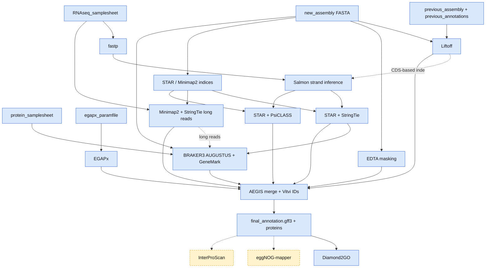
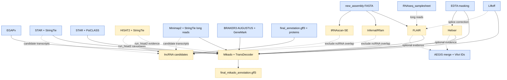
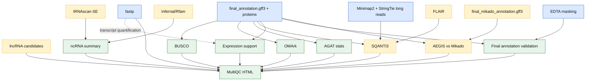

# TITAN: The Intensive Transcript Annotation Pipeline

     

TITAN is a Nextflow pipeline for eukaryotic genome annotation centered on
AEGIS-based evidence integration. It generates and harmonizes transferred
annotation, RNA-seq transcript evidence, protein-supported ab initio
prediction, repeat masking, EGAPx, optional ncRNA/lncRNA and isoform branches,
then uses AEGIS to merge these evidence tracks into a final annotation with
functional annotation and quality reporting in one reproducible graph.

Contributors: David Navarro, Antonio Santiago, Jose Tomas Matus, Amandine
Velt, Camille Rustenholz and Marco Moretto.

Installation is in [docs/user/installation.md](docs/user/installation.md).
Input formats are in [docs/user/inputs.md](docs/user/inputs.md), input/output
tree layouts are in [docs/user/inputs_outputs.md](docs/user/inputs_outputs.md),
reference data preparation is in [docs/user/reference-data.md](docs/user/reference-data.md),
and production operations are in [docs/user/production-run.md](docs/user/production-run.md).
Tool details are in [docs/reference/tools.md](docs/reference/tools.md), and
the command-line reference is in
[docs/reference/tool-commands.md](docs/reference/tool-commands.md).
Contributor guidance is in [CONTRIBUTING.md](CONTRIBUTING.md).
Site-specific examples are kept under [examples/](examples/).

## Table Of Contents

- [What TITAN Produces](#what-titan-produces)
- [Workflow Graph](#workflow-graph)
- [Quick Start](#quick-start)
- [Requirements](#requirements)
- [Inputs](#inputs)
- [Input And Output Trees](#input-and-output-trees)
- [Tool Matrix](#tool-matrix)
- [Profiles](#profiles)
- [Outputs](#outputs)
- [Resume And Re-Runs](#resume-and-re-runs)
- [Troubleshooting](#troubleshooting)
- [Limitations](#limitations)
- [Tool References](#tool-references)

## What TITAN Produces

TITAN has one public execution mode: evidence generation, EDTA, EGAPx and
AEGIS always run together. Long-read processing is automatic when
`RNAseq_samplesheet` contains at least one `library_layout=long` row.

Core outputs are a final AEGIS GFF3/protein set, transferred and predicted
evidence tracks, optional alternative/specialized annotations, functional
annotation tables, provenance manifests, validation reports and a final
MultiQC HTML report.

## Workflow Graph


```mermaid
flowchart TD
    classDef core fill:#dbe9ff,stroke:#3366cc,color:#111
    classDef opt fill:#fff3cd,stroke:#cc9900,color:#111,stroke-dasharray:4 3
    classDef qc fill:#e6f4ea,stroke:#2e7d32,color:#111

    NEW[new_assembly FASTA]:::core
    PREV[previous_assembly + previous_annotations]:::core
    RNA[RNAseq_samplesheet]:::core
    PROT[protein_samplesheet]:::core
    EGCFG[egapx_paramfile]:::core

    LIFT[Liftoff]:::core
    EDTA[EDTA masking]:::core
    EGAPX[EGAPx]:::core
    FASTP[fastp]:::core
    IDX[STAR / Minimap2 indices]:::core
    STRAND[Salmon strand inference]:::core
    STAR[STAR + StringTie]:::core
    PSI[STAR + PsiCLASS]:::core
    HISAT[HISAT2 + StringTie]:::opt
    MM2[Minimap2 + StringTie long reads]:::core
    BRAKER[BRAKER3 AUGUSTUS + GeneMark]:::core

    TRNA[tRNAscan-SE]:::opt
    RFAM[Infernal/Rfam]:::opt
    HELIXER[Helixer]:::opt
    FLAIR[FLAIR]:::opt

    AEGIS[AEGIS merge + Vitvi IDs]:::core
    FINAL[final_annotation.gff3 + proteins]:::core
    D2GO[Diamond2GO]:::core
    EGG[eggNOG-mapper]:::opt
    IPS[InterProScan]:::opt

    LNC[lncRNA candidates]:::opt
    MIK[Mikado + TransDecoder]:::opt
    MIKGFF[final_mikado_annotation.gff3]:::opt

    BUSCO[BUSCO]:::opt
    OMARK[OMArk]:::opt
    SQANTI[SQANTI3]:::opt
    AGAT[AGAT stats]:::qc
    NCRNA[ncRNA summary]:::qc
    EXPR[Expression support]:::qc
    VALID[Final annotation validation]:::qc
    SRCQC[AEGIS vs Mikado]:::opt
    MULTIQC[MultiQC HTML]:::qc

    NEW --> LIFT & EDTA & TRNA & RFAM & IDX & BRAKER & FLAIR
    PREV --> LIFT
    EGCFG --> EGAPX
    RNA --> FASTP
    RNA --> MM2
    RNA -.long reads.-> FLAIR
    FASTP --> STRAND
    LIFT -.CDS-based index.-> STRAND
    STRAND --> STAR & PSI
    STRAND -.run_hisat2.-> HISAT
    IDX --> STAR & MM2 & PSI
    IDX -.run_hisat2.-> HISAT
    PROT --> BRAKER
    STAR --> BRAKER
    MM2 -.long reads.-> BRAKER
    EDTA --> HELIXER
    LIFT -.splice correction.-> FLAIR

    LIFT & EGAPX & BRAKER & STAR & PSI & MM2 --> AEGIS
    EDTA --> AEGIS
    HELIXER & FLAIR -.optional evidence.-> AEGIS
    AEGIS --> FINAL --> D2GO
    FINAL -.-> EGG & IPS

    FINAL --> LNC
    TRNA & RFAM -.exclude ncRNA overlap.-> LNC
    STAR & MM2 -.candidate transcripts.-> LNC
    HISAT -.optional candidates.-> LNC
    LIFT & EGAPX & BRAKER & STAR & PSI & MM2 & HELIXER & FLAIR --> MIK
    HISAT -.optional evidence.-> MIK
    EDTA --> MIK
    MIK --> MIKGFF

    FINAL --> BUSCO & OMARK & AGAT & SQANTI & EXPR
    FASTP -.transcript quantification.-> EXPR
    EDTA & FINAL --> VALID
    TRNA & RFAM --> NCRNA
    MM2 & FLAIR --> SQANTI
    FINAL & MIKGFF --> SRCQC
    FASTP & BUSCO & OMARK & AGAT & NCRNA & LNC & SQANTI & EXPR & SRCQC & VALID --> MULTIQC
```

Blue nodes are the core graph, yellow dashed nodes are optional branches, and
green nodes are quality-report steps. Strand inference (Salmon, seeded by a
Liftoff-derived CDS index) runs once per short-read sample directly on the
fastp-trimmed FASTQs, before alignment, so it can pick the STAR/PsiCLASS
alignment options and the stranded/unstranded StringTie/PsiCLASS assembly
groups; it does not consume alignment output. AEGIS merges STAR-based
(StringTie and PsiCLASS) and Minimap2/StringTie long-read evidence; the
optional HISAT2/StringTie tracks feed Mikado, lncRNA candidates and provenance
only when `--run_hisat2 true`; they do not feed AEGIS. Nextflow's per-run
`-with-dag` report shows the full per-sample task fan-out.

### Decomposed Sub-Workflows

The full graph above is dense because it overlays the mandatory pipeline,
the optional evidence branches and the QC/reporting stage in one diagram.
The three views below split it along those phases for easier reading; nodes
and colors match the full graph.

**1. Core pipeline** (always runs: Liftoff, RNA-seq alignment/assembly, EDTA,
EGAPx, BRAKER3, AEGIS merge, functional annotation):


```mermaid
flowchart TD
    classDef core fill:#dbe9ff,stroke:#3366cc,color:#111
    classDef opt fill:#fff3cd,stroke:#cc9900,color:#111,stroke-dasharray:4 3

    NEW[new_assembly FASTA]:::core
    PREV[previous_assembly + previous_annotations]:::core
    RNA[RNAseq_samplesheet]:::core
    PROT[protein_samplesheet]:::core
    EGCFG[egapx_paramfile]:::core

    LIFT[Liftoff]:::core
    EDTA[EDTA masking]:::core
    EGAPX[EGAPx]:::core
    FASTP[fastp]:::core
    IDX[STAR / Minimap2 indices]:::core
    STRAND[Salmon strand inference]:::core
    STAR[STAR + StringTie]:::core
    PSI[STAR + PsiCLASS]:::core
    MM2[Minimap2 + StringTie long reads]:::core
    BRAKER[BRAKER3 AUGUSTUS + GeneMark]:::core

    AEGIS[AEGIS merge + Vitvi IDs]:::core
    FINAL[final_annotation.gff3 + proteins]:::core
    D2GO[Diamond2GO]:::core
    EGG[eggNOG-mapper]:::opt
    IPS[InterProScan]:::opt

    NEW --> LIFT & EDTA & IDX & BRAKER
    PREV --> LIFT
    EGCFG --> EGAPX
    RNA --> FASTP
    RNA --> MM2
    FASTP --> STRAND
    LIFT -.CDS-based index.-> STRAND
    STRAND --> STAR & PSI
    IDX --> STAR & MM2 & PSI
    PROT --> BRAKER
    STAR --> BRAKER
    MM2 -.long reads.-> BRAKER

    LIFT & EGAPX & BRAKER & STAR & PSI & MM2 --> AEGIS
    EDTA --> AEGIS
    AEGIS --> FINAL --> D2GO
    FINAL -.-> EGG & IPS
```

**2. Optional evidence branches** (Helixer, FLAIR, Mikado, lncRNA — enabled
per-project when their reference data are available):


```mermaid
flowchart TD
    classDef core fill:#dbe9ff,stroke:#3366cc,color:#111
    classDef opt fill:#fff3cd,stroke:#cc9900,color:#111,stroke-dasharray:4 3

    NEW[new_assembly FASTA]:::core
    RNA[RNAseq_samplesheet]:::core
    LIFT[Liftoff]:::core
    EDTA[EDTA masking]:::core
    EGAPX[EGAPx]:::core
    STAR[STAR + StringTie]:::core
    PSI[STAR + PsiCLASS]:::core
    HISAT[HISAT2 + StringTie]:::opt
    MM2[Minimap2 + StringTie long reads]:::core
    BRAKER[BRAKER3 AUGUSTUS + GeneMark]:::core
    FINAL[final_annotation.gff3 + proteins]:::core
    AEGIS[AEGIS merge + Vitvi IDs]:::core

    TRNA[tRNAscan-SE]:::opt
    RFAM[Infernal/Rfam]:::opt
    HELIXER[Helixer]:::opt
    FLAIR[FLAIR]:::opt
    LNC[lncRNA candidates]:::opt
    MIK[Mikado + TransDecoder]:::opt
    MIKGFF[final_mikado_annotation.gff3]:::opt

    NEW --> TRNA & RFAM & FLAIR
    RNA -.long reads.-> FLAIR
    LIFT -.splice correction.-> FLAIR
    EDTA --> HELIXER
    HELIXER & FLAIR -.optional evidence.-> AEGIS

    FINAL --> LNC
    TRNA & RFAM -.exclude ncRNA overlap.-> LNC
    STAR & MM2 -.candidate transcripts.-> LNC
    HISAT -.run_hisat2 candidates.-> LNC

    LIFT & EGAPX & BRAKER & STAR & PSI & MM2 & HELIXER & FLAIR --> MIK
    HISAT -.run_hisat2 evidence.-> MIK
    EDTA --> MIK
    MIK --> MIKGFF
```

**3. QC and reporting** (everything feeding the final MultiQC report):


```mermaid
flowchart TD
    classDef core fill:#dbe9ff,stroke:#3366cc,color:#111
    classDef opt fill:#fff3cd,stroke:#cc9900,color:#111,stroke-dasharray:4 3
    classDef qc fill:#e6f4ea,stroke:#2e7d32,color:#111

    FASTP[fastp]:::core
    EDTA[EDTA masking]:::core
    FINAL[final_annotation.gff3 + proteins]:::core
    MM2[Minimap2 + StringTie long reads]:::core

    TRNA[tRNAscan-SE]:::opt
    RFAM[Infernal/Rfam]:::opt
    FLAIR[FLAIR]:::opt
    LNC[lncRNA candidates]:::opt
    MIKGFF[final_mikado_annotation.gff3]:::opt
    SQANTI[SQANTI3]:::opt
    SRCQC[AEGIS vs Mikado]:::opt

    BUSCO[BUSCO]:::qc
    OMARK[OMArk]:::qc
    AGAT[AGAT stats]:::qc
    NCRNA[ncRNA summary]:::qc
    EXPR[Expression support]:::qc
    VALID[Final annotation validation]:::qc
    MULTIQC[MultiQC HTML]:::qc

    FINAL --> BUSCO & OMARK & AGAT & SQANTI & EXPR
    FASTP -.transcript quantification.-> EXPR
    EDTA & FINAL --> VALID
    TRNA & RFAM --> NCRNA
    MM2 & FLAIR --> SQANTI
    FINAL & MIKGFF --> SRCQC
    FASTP & BUSCO & OMARK & AGAT & NCRNA & LNC & SQANTI & EXPR & SRCQC & VALID --> MULTIQC
```

## Quick Start

```bash
git clone git@github.com:Grapedia/workflows.git
cd workflows/TITAN
scripts/run-tests.sh
```

Production runs should go through the launcher. The base command runs the
mandatory graph: Liftoff, RNA-seq evidence, EDTA, EGAPx, BRAKER3, AEGIS,
Diamond2GO and default quality checks.

```bash
./launch_TITAN_example.sh \
  --profile slurm,apptainer \
  --output-dir /absolute/path/to/project/titan_out \
  --previous-assembly /absolute/path/to/project/assemblies/previous.fa \
  --new-assembly /absolute/path/to/project/assemblies/target.fa \
  --previous-annotations /absolute/path/to/project/annotations/previous.gff3 \
  --rnaseq-samplesheet /absolute/path/to/project/rnaseq/RNAseq_samplesheet.csv \
  --rnaseq-data-dir /absolute/path/to/project/rnaseq \
  --protein-samplesheet /absolute/path/to/project/proteins/protein_samplesheet.csv \
  --egapx-paramfile /absolute/path/to/project/egapx/input_egapx.yaml \
  --run-name titan_target_v1 \
  --resume
```

Add optional branches when their reference data are available, or let the
launcher prepare supported datasets before the run:

```bash
./launch_TITAN_example.sh \
  --profile slurm,apptainer \
  --output-dir /absolute/path/to/project/titan_out \
  --previous-assembly /absolute/path/to/project/assemblies/previous.fa \
  --new-assembly /absolute/path/to/project/assemblies/target.fa \
  --previous-annotations /absolute/path/to/project/annotations/previous.gff3 \
  --rnaseq-samplesheet /absolute/path/to/project/rnaseq/RNAseq_samplesheet.csv \
  --rnaseq-data-dir /absolute/path/to/project/rnaseq \
  --protein-samplesheet /absolute/path/to/project/proteins/protein_samplesheet.csv \
  --egapx-paramfile /absolute/path/to/project/egapx/input_egapx.yaml \
  --run-name titan_target_v1 \
  --prepare-egapx-cache \
  --enable-eggnog-mapper --prepare-eggnog-data \
  --enable-helixer --prepare-helixer-model --helixer-lineage land_plant \
  --enable-interproscan --prepare-interproscan-data \
  --enable-busco --prepare-busco-data \
  --enable-rfam --prepare-rfam-data \
  --enable-omark --prepare-omark-data \
  --enable-lncrna --prepare-cpat-model \
  --resume
```

Options without dedicated launcher flags, such as Mikado, FLAIR or SQANTI3,
can be passed after `--` as native Nextflow parameters; see
[reference-data.md](docs/user/reference-data.md) and
[production-run.md](docs/user/production-run.md).

The launcher resolves paths, checks profile/container contracts, validates
inputs and writes Nextflow reports under `${output_dir}/nextflow_reports`.

## Requirements

Use Linux or HPC with Bash, Git, Python 3, Java, Nextflow `24.04.3`, and Docker
or Apptainer/Singularity. EGAPx also needs host `python3`, `curl`, `tar` and
Python `yaml` because TITAN launches the official nested EGAPx runner.

## Inputs

| Parameter | Required content |
| --- | --- |
| `--new_assembly` | Target genome assembly FASTA. |
| `--previous_assembly` | Reference assembly FASTA for Liftoff. |
| `--previous_annotations` | GFF3 matching `--previous_assembly`. |
| `--RNAseq_samplesheet` | CSV with `sampleID,SRA_or_FASTQ,library_layout`. |
| `--RNAseq_data_dir` | Local FASTQ/FASTA directory for samplesheet rows. |
| `--protein_samplesheet` | CSV with `organism,filename` protein FASTA evidence. |
| `--egapx_paramfile` | EGAPx YAML with at least `genome`, `taxid`, `organism`. |
| `--output_dir` | TITAN output directory. |

RNA-seq `library_layout` values are `single`, `paired` and `long`.
`SRA_or_FASTQ` values are `FASTQ`, `FASTA` for long reads, and `SRA` accessions
resolved through ENA FASTQ metadata. Local files are inferred from `sampleID`.
Absolute paths are recommended for production and HPC runs.

## Input And Output Trees

Recommended production input layout:

```text
project/
  assemblies/
    target.fa                    # --new_assembly
    previous.fa                  # --previous_assembly
  annotations/
    previous.gff3                # --previous_annotations
  rnaseq/
    RNAseq_samplesheet.csv       # --RNAseq_samplesheet
    <sample>.fastq.gz            # single-end short reads
    <sample>_1.fastq.gz          # paired-end R1
    <sample>_2.fastq.gz          # paired-end R2
    <long_sample>.fastq.gz       # optional long-read RNA evidence
  proteins/
    protein_samplesheet.csv      # --protein_samplesheet
    *.fa                         # protein evidence FASTAs
  egapx/
    input_egapx.yaml             # --egapx_paramfile
  titan_out/                     # --output_dir
```

Main output layout after a complete run:

```text
${output_dir}/
  aegis_outputs/                 # primary final annotation and proteins
  assembly_masked.EDTA.fasta     # EDTA-masked target assembly
  liftoff_previous_annotations.gff3
  merged_*_stringtie*.gtf        # merged transcript evidence tracks
  merged_star_psiclass_*.gtf
  egapx/                         # EGAPx annotation products
  additional_annotations/        # tRNA, Rfam, FLAIR, Helixer, lncRNA, SQANTI3
  final_annotations/mikado/      # optional Mikado annotation
  Diamond2GO_outputs/            # default functional annotation
  EggNOG_outputs/                # optional eggNOG-mapper output
  InterProScan_outputs/          # optional InterProScan output
  quality_report/                # MultiQC and per-tool QC
  validation/                    # final annotation validation reports
  provenance/                    # manifests, checksums and software versions
  intermediate_files/            # optional published intermediates
  nextflow_reports/              # launcher DAG/progress/report files
```

See [docs/user/inputs_outputs.md](docs/user/inputs_outputs.md) for the full
tree, including optional branches and files controlled by
`--publish_intermediates`.

## Tool Matrix

Detailed behavior, setup notes and outputs are in [docs/reference/tools.md](docs/reference/tools.md).

| Tool or branch | Default | Purpose |
| --- | --- | --- |
| [Input validation](docs/reference/tools.md#input-validation) | on | Checks inputs before heavy work starts. |
| [tRNAscan-SE](docs/reference/tools.md#trnascan-se) | off | Optional tRNA annotation. |
| [Infernal/Rfam](docs/reference/tools.md#infernalrfam-ncrna) | off | Optional ncRNA family search. |
| [RNA-seq evidence](docs/reference/tools.md#rna-seq-evidence) | on | Builds STAR/Minimap2 transcript evidence; HISAT2 is opt-in with `--run_hisat2 true`. |
| [Liftoff](docs/reference/tools.md#liftoff) | on | Transfers previous annotation. |
| [EGAPx](docs/reference/tools.md#egapx) | on | Adds official NCBI annotation evidence. |
| [FLAIR](docs/reference/tools.md#flair-long-read-isoforms) | off | Optional long-read isoform evidence. |
| [EDTA](docs/reference/tools.md#edta) | on | Produces the hard-masked genome for AEGIS. |
| [BRAKER3](docs/reference/tools.md#braker3) | on | Generates ab initio gene predictions. |
| [Helixer](docs/reference/tools.md#helixer) | off | Optional deep-learning prediction evidence. |
| [AEGIS](docs/reference/tools.md#aegis) | on | Integrates evidence into the primary annotation. |
| [Mikado + TransDecoder](docs/reference/tools.md#mikado-final-annotation-source) | off | Optional alternative final annotation source. |
| [lncRNA candidates](docs/reference/tools.md#lncrna-candidates) | off | Optional CPAT-plant candidate layer. |
| [SQANTI3](docs/reference/tools.md#sqanti3-long-read-isoform-qc) | off | Optional long-read isoform QC. |
| [Diamond2GO](docs/reference/tools.md#diamond2go) | on | Annotates final AEGIS proteins. |
| [eggNOG-mapper](docs/reference/tools.md#eggnog-mapper) | off | Optional orthology/function. |
| [InterProScan](docs/reference/tools.md#interproscan) | off | Optional domains, GO and pathways. |
| [Quality report](docs/reference/tools.md#quality-report) | mixed | BUSCO, OMArk, AGAT, expression and MultiQC. |

## Profiles

| Profile | Purpose |
| --- | --- |
| `test` | Local fixture validation; no Docker, Slurm or production data. |
| `local` | Local Docker-oriented production run. |
| `apptainer` | Apptainer/Singularity runtime. |
| `slurm` | Slurm executor settings. |
| `slurm,apptainer` | Recommended HPC production profile. |

Resource policy is centralized in [conf/base.config](conf/base.config).

## Outputs

The primary files to inspect first are
`${output_dir}/aegis_outputs/final_annotation.gff3`,
`${output_dir}/aegis_outputs/final_annotation_proteins_all.fasta`,
`${output_dir}/aegis_outputs/final_annotation_proteins_main.fasta` and
`${output_dir}/quality_report/titan_multiqc_report.html`.

Intermediate/debug outputs are controlled by `--publish_intermediates`
(`true` by default for backward compatibility). The complete output map is in
[docs/user/inputs_outputs.md](docs/user/inputs_outputs.md).

## Resume And Re-Runs

Use `-resume` or `./launch_TITAN_example.sh --resume` after interrupted runs.
Keep the same `--output-dir`, `--work-dir`, profile combination and input paths.
For production, preserve the Nextflow work directory, `.nextflow.log`,
`${output_dir}/nextflow_reports` and `${output_dir}/provenance`.

## Troubleshooting

| Message or symptom | Check |
| --- | --- |
| `Missing required parameter(s)` | Provide every mandatory input. |
| `Required input file(s) not found` | Verify paths on the executing node. |
| `library_layout must be one of` | Use `single`, `paired` or `long`. |
| `at least one short-read row` | Include at least one short-read sample. |
| `--workflow is no longer supported` | Remove `--workflow`; TITAN always runs the full graph. |
| Image, EGAPx or Apptainer failure | Check pinned image access and writable shared cache dirs. |
| STAR memory failure | Increase memory for `star_alignment` in the active profile. |
| Non-empty output directory | Resume with `--resume`, or intentionally override with `--force`. |

## Limitations

The `test` profile and CI run stub execution on synthetic fixtures. They
validate contracts, wiring and early failures, not scientific annotation
quality. Real Slurm/Apptainer behavior still depends on site queue policy,
shared filesystems and container cache settings.

## Tool References

Primary workflow and orchestration:
[Nextflow](https://www.nextflow.io/),
[Apptainer](https://apptainer.org/),
[Slurm](https://slurm.schedmd.com/).

Input, transfer and evidence generation:
[ENA Browser API](https://www.ebi.ac.uk/ena/browser/api/),
[fastp](https://github.com/OpenGene/fastp),
[Liftoff](https://github.com/agshumate/Liftoff),
[Salmon](https://combine-lab.github.io/salmon/),
[STAR](https://github.com/alexdobin/STAR),
[HISAT2](https://daehwankimlab.github.io/hisat2/),
[Minimap2](https://github.com/lh3/minimap2),
[StringTie](https://ccb.jhu.edu/software/stringtie/),
[PsiCLASS](https://github.com/splicebox/PsiCLASS),
[GFFCompare](https://ccb.jhu.edu/software/stringtie/gffcompare.shtml).

Genome annotation and integration:
[EDTA](https://github.com/oushujun/EDTA),
[EGAPx](https://github.com/ncbi/egapx),
[BRAKER3](https://github.com/Gaius-Augustus/BRAKER),
[GeneMark-ETP](http://exon.gatech.edu/GeneMark/),
[AUGUSTUS](https://github.com/Gaius-Augustus/Augustus),
[Helixer](https://github.com/weberlab-hhu/Helixer),
[AEGIS](https://github.com/Tomsbiolab/aegis),
[AGAT](https://github.com/NBISweden/AGAT).

Optional isoform, ncRNA and lncRNA branches:
[FLAIR](https://github.com/BrooksLabUCSC/flair),
[Mikado](https://github.com/EI-CoreBioinformatics/mikado),
[TransDecoder](https://github.com/TransDecoder/TransDecoder),
[SQANTI3](https://github.com/ConesaLab/SQANTI3),
[tRNAscan-SE](http://trna.ucsc.edu/tRNAscan-SE/),
[Infernal](http://eddylab.org/infernal/),
[Rfam](https://rfam.org/),
[CPAT](https://cpat.readthedocs.io/).

Functional annotation and quality reporting:
[Diamond2GO](https://github.com/rhysf/Diamond2GO),
[eggNOG-mapper](https://github.com/eggnogdb/eggnog-mapper),
[InterProScan](https://github.com/ebi-pf-team/interproscan),
[BUSCO](https://busco.ezlab.org/),
[OMArk](https://github.com/DessimozLab/OMArk),
[MultiQC](https://multiqc.info/).

Internal TITAN references:
[tool behavior](docs/reference/tools.md) and
[tool command lines](docs/reference/tool-commands.md).
