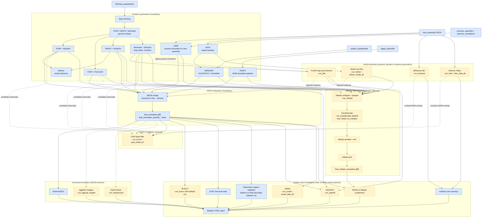

# TITAN documentation cleanup plan

Goal: turn TITAN's documentation into something safe to hand to external
developer colleagues and users, and to cite/link from a scientific
publication — no development-session traces (dated debugging notes, task IDs,
AI-agent prompts, audit logs), no duplicated/contradictory content, a single
place to start reading, and one diagram that actually shows every step,
every tool and every option currently in the graph.

This file is a plan, not the rewrite itself. Completed items are marked
`[done]`. Each section names the exact file(s), what is wrong with them
today, and what to do. Priority order matches the numbered sections.

---

## 0. Already done

- [done] `to_do_add.md` deleted (`git rm`). It was a personal development
  roadmap/status log (13 phases, dated "Statut TITAN codex-dev" entries,
  milestone tracking) with zero value to an external reader.
- [done] Section 1 development-session artifacts removed. Durable architecture
  rationale was rewritten into `docs/development/ARCHITECTURE.md`.
- [done] Section 2 broken/stale README references fixed.
- [done] Section 3 developer references cleaned and linked from
  `CONTRIBUTING.md`.

---

## 1. Delete — pure development-session artifacts

These files exist only because an AI coding agent (Codex/Claude) needed
operating instructions or produced a session transcript. They reference a
throwaway dev VM path (`/home/vmadmin/...`), a branch name from a past
session (`codex/titan-hardening`), specific dated incidents, and internal
task IDs (`P0-00x`, `P1-00x`). None of it is meaningful to a developer
colleague reading the repo fresh, and it actively signals "this was
AI-generated" to a publication reviewer.

| File | What it is | Action |
| --- | --- | --- |
| `dev.md` | Copy-paste bootstrap prompt for a Codex worktree session (`.claude-worktrees/codex-dev`), references a specific past incident | **Delete** |
| `prompt.md` | Full AI-agent operating instructions ("Prompt de developpement pour TITAN"), references `/home/vmadmin/atcg-rnaseq` | **Delete** |
| `docs/development/audit.md` | Dated (2026-07-16) session log: git commands run, directory listing, "P1-XXX" task references, branch `codex/titan-hardening` | **Delete** |
| `docs/development/p0-hardening.md` | Dated session summary of "P0" tasks, references the two files above | **Delete** |

Before deleting `docs/development/audit.md` and `p0-hardening.md`, check
whether any *durable* fact only lives there (e.g. a design decision with no
other record). Section 3 below folds the few facts worth keeping into
`docs/development/architecture-audit.md` (see next section) so nothing
technical is lost, just the session narrative around it.

Also worth a decision: `docs/development/architecture-audit.md` itself
(282 lines) is written the same way (dated, "P1-002 did X", "Highest-risk
findings"), but roughly a third of it is durable architectural rationale
(why `main.nf` is a thin entrypoint, why EDTA/EGAPx are mandatory, why
long-read detection comes from the samplesheet and not a flag). Recommend
**rewriting it as `docs/development/ARCHITECTURE.md`**: present tense, no
dates, no P1-XXX numbering, organized by topic ("Why main.nf stays thin",
"Why EDTA and EGAPx are mandatory", "Evidence channel contracts", "Container
pinning policy") instead of as an audit trail. Everything session-flavored
(git log excerpts, "Executive summary" framed as a review of past work)
gets cut.

---

## 2. Delete or fix — broken/stale references

- [done] **`README.md` "Workflow Diagram" section** (``):
  this file does not exist on disk — it's a dead image link right now. Being
  replaced by the Mermaid diagram in section 4 below, so remove the ``
  reference entirely once that lands rather than trying to regenerate the jpg.
- [done] **`README.md` line 7**: "Development audits and implementation notes are
  under `docs/development`" — update this pointer once section 1/3 lands
  (fewer, cleaner files there), and reword it as a contributor pointer, not
  a "here's our dev history" pointer.

---

## 3. Keep, but move/clean — genuinely useful developer reference

These have real, timeless content (not session narrative) and should stay,
just relocated/tidied so `docs/development/` reads as "how to contribute"
rather than "how the AI agent worked":

| File | Verdict |
| --- | --- |
| `docs/development/nextflow-dsl2-conventions.md` | [done] Kept as-is and linked from `CONTRIBUTING.md`. |
| `docs/development/container-locks.md` | [done] Kept with stable filename and linked from `CONTRIBUTING.md`. |
| `docs/development/architecture-audit.md` | [done] Rewritten into `docs/development/ARCHITECTURE.md` as durable rationale only. |

Recommended end state for `docs/development/`:

```
docs/development/
  ARCHITECTURE.md            (rewritten from architecture-audit.md)
  nextflow-dsl2-conventions.md
  container-locks.md
```

[done] `CONTRIBUTING.md` is now the contributor entrypoint and links to the
three stable `docs/development/` references instead of duplicating them.

---

## 4. `README.md` — restructure

Current state after sections 1-3: `README.md` is cleaner, but still has one
flat user-facing file mixing quick start, detailed per-tool reference
sections, a full outputs table, and troubleshooting. There is still no
pipeline diagram near the intro, so a reader has no compact way to see what
the pipeline actually does before scrolling through setup instructions.

Plan:

1. [done] **Move "Developer Quality Contract" to `CONTRIBUTING.md`**
   (see section 3). A user citing TITAN in a methods section does not need
   to know the module-authoring conventions.
2. **Add the pipeline diagram right after the intro** (section 5 below),
   before "Quick Start" — a reader (colleague or reviewer) should see the
   whole graph before reading setup instructions.
3. **Move the 14 per-tool paragraphs (lines 224-305) to a new
   `docs/reference/tools.md`**, one section per tool, keep the same content
   (it's good, accurate, current — just too long for the README itself).
   Replace them in `README.md` with a compact table: tool name, flag,
   default, one-line purpose, link to the detail section. This is the
   biggest single length reduction available (roughly 80 lines → a
   15-row table).
4. **Keep in `README.md`**: intro/contributors, Current Contract, Quick
   Start, Requirements, Input Files, RNA-seq/Protein samplesheet formats,
   EGAPx input, Profiles, the compact tool table from point 3, the Outputs
   table (it's the single most useful reference for a new user and is
   already reasonably tight), Resume/Re-runs, Troubleshooting, Limitations,
   Tool References (citations — useful for a methods section).
5. **Move "Validation and CI" section to `CONTRIBUTING.md`** — it's about
   running the dev test suite, not about using the pipeline.

Target: `README.md` under ~250 lines, `docs/reference/tools.md` holding the
detailed per-tool behavior, `CONTRIBUTING.md` holding the module-authoring
contract + test/validation instructions.

---

## 5. New: full pipeline diagram

This is the "graphe total de toutes les étapes avec outils, options, comment
c'est liés" the README needs. Use a Mermaid flowchart (renders natively on
GitHub, stays text-diffable in git — no binary image to regenerate and go
stale like the dead `TITAN_diagram.jpg`).

Draft below, organized by subgraph to stay readable. Optional
branches (anything gated by a `--run_*` flag defaulting to `false`, plus
`run_helixer`/`run_eggnog_mapper`/`run_interproscan`/`run_busco`/
`run_omark` which also default `false`, and `run_transdecoder` which
defaults `true` but only matters when `run_mikado true`) are styled
distinctly from the mandatory path. This draft should be reviewed against
`workflows/titan.nf` / `subworkflows/*.nf` once more before it goes into the
README — it was built from today's audit of the graph, not re-verified line
by line against the current DSL.



Legend to include next to the diagram in the README:

* Blue, solid border = always runs.
* Yellow, dashed border = optional, off by default unless noted, enabled
  with the `--run_*` flag shown.
* Green = quality-report step.

This diagram intentionally omits fine-grained sub-steps (e.g. individual
STAR/HISAT2 per-sample fan-out, the four StringTie stranded/unstranded
variants) to stay readable — it documents the tool-level graph, not the
per-task DAG (Nextflow's own `-with-dag` output already covers that at
full resolution per run).

---

## 6. `docs/user/installation.md` — gap to fill

589 lines, well-organized (14 numbered sections), no development-session
traces found. Genuinely good user documentation. **One real gap**: sections
8-10 cover eggNOG-mapper/Helixer/InterProScan offline-data setup, but there
is no equivalent section for the 8 tools added since (tRNAscan-SE, Rfam,
lncRNA/CPAT, Mikado, TransDecoder, FLAIR, SQANTI3, OMArk) — a new user
following this guide today would have no instructions for
`scripts/download_rfam_data.sh` / `scripts/download_omark_data.sh` or the
corresponding `--prepare-rfam-data` / `--prepare-omark-data` launcher flags,
even though `README.md` documents the tools themselves.

Action: add sections 8a-8h (or renumber) following the exact pattern of the
existing eggNOG-mapper/Helixer/InterProScan sections (what the tool does,
how to fetch offline data once, which flags enable it, link to the
`README.md` tool-reference entry once section 4 lands).

---

## 7. `data/slurm_apptainer.config` — trim dev-session narrative from comments

This file is tracked in git (confirmed during the codex-dev merge work —
it is **not** covered by `.gitignore` despite living under `TITAN/data/`,
because it was added before that ignore pattern existed). It will ship to
every colleague who clones the repo, so its comments are effectively public
documentation of the Colmar cluster deployment, not private scratch notes.

Most of it is legitimate, valuable operational tuning rationale (why
`process_trim` gets less memory than `process_alignment`, why some labels
need a narrower `--nodelist`). Keep the *facts*. Rewrite the *framing*:
comments like "used to share process_alignment and that alone was enough to
starve the Slurm queue for hours on job 532274 (2026-07-17)" should become
"fastp only needs a couple of threads and a few GB of RAM, unlike real
alignment/index jobs — giving it `process_alignment`'s 96GB budget wastes
node capacity it doesn't need." Same fact, no incident-report framing, no
job ID, no date.

Same treatment for the one comment in `conf/slurm.config` referencing
"confirmed empirically" without further detail — keep the conclusion, drop
the "confirmed empirically" framing (either state it as fact, or footnote
briefly why, without narrating the debugging process).

This is a low-risk, mechanical pass: read every comment in both files,
keep the technical conclusion, cut anything written like a debugging
session note (dates, job IDs, "we found that...", "confirmed empirically").

---

## Suggested order of execution

1. Section 1 deletions (`dev.md`, `prompt.md`, `docs/development/audit.md`,
   `docs/development/p0-hardening.md`) — fast, unambiguous, zero risk once
   confirmed.
2. Section 7 (`data/slurm_apptainer.config` / `conf/slurm.config` comment
   cleanup) — mechanical, no structural change, safe to do independently.
3. Section 3 (`architecture-audit.md` → `ARCHITECTURE.md` rewrite,
   `CONTRIBUTING.md` creation).
4. Section 4 + 5 together (`README.md` restructure needs the diagram to
   land in the same pass, otherwise the README is briefly missing the thing
   it's being restructured to showcase).
5. Section 6 (`docs/user/installation.md` new tool sections) — independent,
   can happen any time after section 4 gives it something to link to.

Everything above is additive/reversible through git except the section 1
deletions, which is why those are listed as a plan here rather than already
executed alongside `to_do_add.md`.
