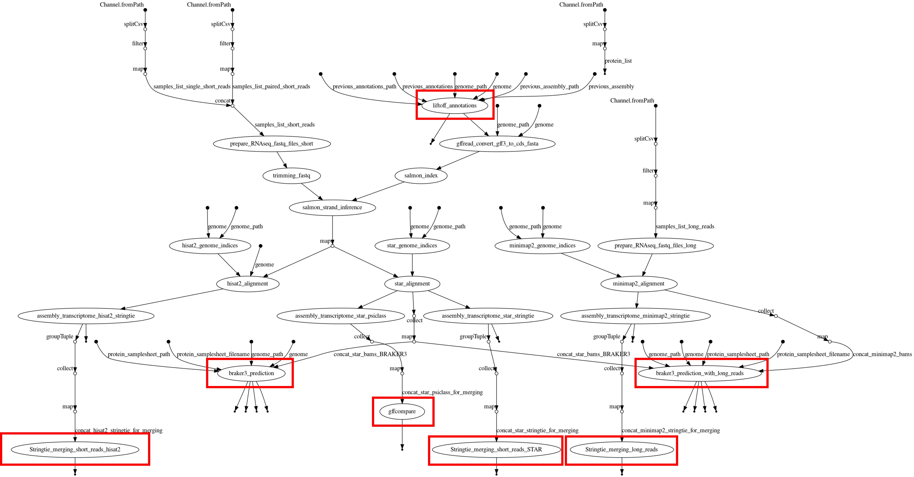

# TITAN: The Intensive Transcript Annotation Pipeline

📖 **Full documentation**: [Read the Docs](https://grapedia.readthedocs.io/en/latest/workflows.html#titan-the-intensive-transcript-annotation-pipeline)

## Workflow DAG

## Workflow Components

### **Liftoff Annotations**
Generates a **GFF3 file**, which is used by **Aegis** in the final step.

### **StringTie Merging (Short Reads - HISAT2)**
Generates **GTF file(s)**.  
- For each **short-read RNA-seq dataset**, a transcriptome is assembled using **HISAT2/StringTie**.  
- Transcriptomes are then **merged separately** for **stranded** and **unstranded** samples (unstranded is optional).  
- ⚠️ **This output is not used yet**—it is intended for **lncRNA detection**, which is not yet implemented.

### **StringTie Merging (Short Reads - STAR)**
Generates **GTF file(s)**, which are used by **Aegis** in the final step.  
- For each **short-read RNA-seq dataset**, a transcriptome is assembled using **STAR/StringTie** with **default** and **alternative (alt) parameters**.  
- Transcriptomes are **merged separately** for **stranded** and **unstranded** samples (unstranded is optional) and for **default and alt parameters** separately.

### **StringTie Merging (Long Reads)**
Generates a **single GTF file**, which is used by **Aegis** in the final step.  
- For each **IsoSeq RNA-seq dataset**, a transcriptome is assembled using **Minimap2/StringTie** with **default** and **alt parameters**.  
- These transcriptomes are then **merged into a single GTF file**, for **default and alt parameters** separately.
- ⚠️ **Long-read integration is optional**.

### **BRAKER3 Gene Prediction**
#### **braker3_prediction OR braker3_prediction_with_long_reads**
- **BRAKER3** is run with all **BAM files**, generated using **STAR (short reads)** or **Minimap2 (long reads)**.
- It also incorporates **protein FASTA files** to generate:
  - A **GeneMark GTF file**.
  - An **AUGUSTUS GFF3 file**, both of which are used by **Aegis** in the final step.

### **GFFCompare**
Generates a **GTF file**, which is used by **Aegis** in the final step.  
- For each **short-read RNA-seq dataset**, a transcriptome is assembled using **STAR/PsiCLASS**.  
- Transcriptomes are **merged separately** for **stranded** and **unstranded** samples using **GFFCompare** (unstranded is optional).

### **EDTA** (Not shown in the DAG but integrated into TITAN)
Generates a **FASTA file** of the **hard-masked genome assembly**, which is used by **Aegis** in the final step.  

- **Input**: The **FASTA file** of the genome assembly to be annotated.  
- **Output**: A **hard-masked version** of the genome assembly.  

---

## **Final Integration by Aegis**
At the final step, **Aegis** integrates multiple annotation sources:  
✔ **Liftoff annotations**  
✔ **GeneMark annotations**  
✔ **AUGUSTUS annotations**  
✔ **Stranded (and unstranded, if available) annotations from STAR/StringTie**  
✔ **IsoSeq annotations (if available)**  
✔ **Stranded (and unstranded, if available) annotations from STAR/PsiCLASS**  

This results in the final **GFF3 annotation file**.
